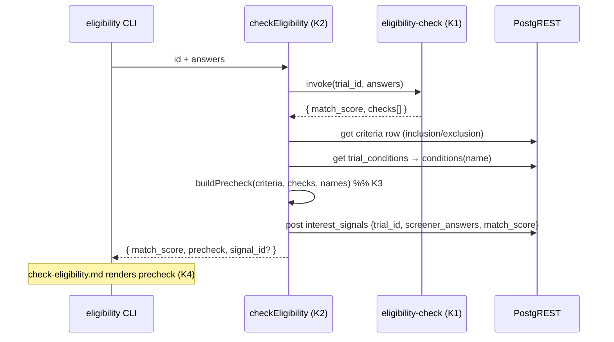

# Design 10-a: Plain-language eligibility pre-check

Spec: [`spec.md`](spec.md). This design adds a patient-readable layer over the
existing `eligibility-check` scorer. The engine is sound (spec X1); the missing
piece is a surface-agnostic view-model that turns the scorer's per-rule verdicts
and a trial's `criteria` row into plain-language self-assessment — rendered
through the `eligibility` CLI command, inherited by every surface.

## The one hard problem

The scorer already decides, per rule, whether a patient fits. Today it flattens
that into machine prose (`reasons: ["Age 55 within [18, 75]", "Meets: …"]`) and
a bare enum (`match_score`). To explain _which rules support fit, which work
against it, and which could not be answered_ (spec C3) **consistently with the
headline score**, the plain-language layer needs the per-rule verdict from the
**same evaluation** that produced the score — not a second opinion. Everything
below follows from where that verdict comes from.

## Components

| #   | Component                  | Path                                                       | Change                                                                                                                                                                                                                                                                 |
| --- | -------------------------- | ---------------------------------------------------------- | ---------------------------------------------------------------------------------------------------------------------------------------------------------------------------------------------------------------------------------------------------------------------- |
| K1  | `eligibility-check` scorer | `services/polaris-functions/eligibility-check/mod.ts`      | `score()` keeps its exact aggregation and `match_score`, and _additionally_ emits a `checks[]` trace of its structured-rule outcomes (age, ECOG, required/excluded conditions). `checks[]` never feeds `match_score`, so the score stays byte-identical to today (X1). |
| K2  | `checkEligibility` handler | `products/polaris/handlers/src/check-eligibility.js`       | Becomes the composition point: invoke scorer → read `criteria` row and condition names → join verdicts into a `precheck` view-model. Interest-signal insert unchanged (C5).                                                                                            |
| K3  | Pre-check view builder     | `products/polaris/handlers/src/precheck-view.js` (new)     | Pure function `buildPrecheck(criteria, checks, conditionNames)`. Groups rules, derives prompts from rule data, translates the outcome. Unit-testable in isolation.                                                                                                     |
| K4  | Result template            | `products/polaris/handlers/templates/check-eligibility.md` | Clean-break rewrite: renders the `precheck` view-model. No raw enum token, no machine prose (C3).                                                                                                                                                                      |

Out of this design: the CLI command definition, the edge scorer's thresholds,
and the web screener (X6) are untouched.

## Interfaces

**K1 — scorer output.** `score()` returns `{ match_score, checks }`. `match_score`
is produced by the current `excluded`/`failed`/`unknown` aggregation, untouched.
`checks[]` covers only the **structured** rules — the ones the plain-language
layer self-assesses (S1) — never the free-text `custom[]` rules, which are
handled by listing (S2) regardless of verdict. Keeping custom verdicts out of
`checks[]` is deliberate: it removes any path by which the trace could disagree
with `match_score`.

```
Check = {
  kind:    "age" | "ecog" | "required_condition" | "excluded_condition",
  key:     string,        // condition slug; "" for age/ecog
  verdict: "supports" | "against" | "unknown",
}
```

`verdict` reflects the scorer's own reading: in-band age / ECOG ≤ max / required
condition present → `supports`; out-of-band / ECOG over / excluded condition
present / required condition absent → `against`; the field not provided →
`unknown`. `score()` today walks only the failing/hit branches (e.g. it records
an excluded condition only when present, `mod.ts:86-92`); the trace fills in the
complementary `supports`/`unknown` per structured rule. That is new derivation
over the same inputs, additive and never touching the aggregation. Likewise, when
`conditions` is unprovided the scorer emits one aggregate `unknown` while
`checks[]` emits one `unknown` **per required/excluded slug** so K3 can render a
prompt for each. The `exclusion` flags `active_autoimmune`/`prior_immunotherapy`
that `score()` does not evaluate today stay out of `checks[]` — the pre-check
adds no clinical evaluation (X1).

**K2 — handler output.** Return gains `precheck`; `match_score` stays top-level
(the web POST route reads only that — `submit/route.ts:45-46`) and `signal_id`
stays optional. `reasons` is dropped: no production surface reads it, and the
handler/template tests that assert on it (`check-eligibility.test.js`,
`templates.test.js`) move with the clean break.

**K3 — view-model.** `buildPrecheck` joins each check to the trial's rule data:

```
precheck = {
  self_assessment:      [ { prompt, verdict } … ],  // age, ECOG, resolved conditions (S1)
  coordinator_questions:[ string … ],               // every custom[] string + unresolved slugs (S2)
  outcome: { stance, supports[], against[], unsure[], disclaimer, next_step },  // (S3,S4)
}
```

`prompt` is a code-owned sentence frame filled from rule data — e.g.
`"Are you between {age_min} and {age_max} years old?"`,
`"Have you been diagnosed with {conditionName}?"`. The frame is UI chrome; the
only trial-specific text is the data-filled slot, so no criterion prose lands
outside `data/synthetic/` (C5, X2). `stance` is the plain-language translation
of `match_score` (e.g. _"You may be a fit"_) — the enum token never reaches the
template. Any stance the structured buckets do not by themselves explain —
a `possibly_eligible` from an unanswered inclusion `custom[]`, or a
`not_eligible` from an exclusion `custom[]` the patient flagged (both live only
in `coordinator_questions`, not `checks[]`) — is attributed to the
coordinator-questions section rather than to a self-assessed rule. This keeps the
headline and the breakdown from contradicting for the cautious _and_ the negative
outcome, honoring C3's could-not-answer case.

## Data flow



The handler reads the `criteria` row and the `trial_conditions` junction with
the same anon `db.get` calls `showTrial` already uses (`show-trial.js:27,42`) —
condition slug→name resolution lives in one place, the handler, exactly as it
does for trial detail. A slug with no `conditions` row cannot be named, so its
rule falls to `coordinator_questions` rather than a fabricated label (spec Scope).

## Key decisions

| Decision                     | Choice                                                           | Rejected                                            | Why                                                                                                                                          |
| ---------------------------- | ---------------------------------------------------------------- | --------------------------------------------------- | -------------------------------------------------------------------------------------------------------------------------------------------- |
| Source of per-rule verdicts  | Scorer emits structured `checks[]`                               | Parse the `reasons` prose in the handler            | Prose phrasing is an implicit contract; one reword silently misclassifies a rule at 3 AM.                                                    |
| Source of per-rule verdicts  | Scorer emits `checks[]`                                          | Handler re-derives verdicts from criteria + answers | Duplicates the clinical evaluation in two homes that can drift — the exact risk X1 guards. Verdict has one home: the scorer.                 |
| Slug→name resolution         | Handler, via `trial_conditions` join                             | Resolve inside the scorer                           | `showTrial` already owns this read; keeping it handler-side avoids splitting condition-naming across two services and keeps the scorer lean. |
| Rule data for prompts        | Handler re-reads the `criteria` row                              | Return criteria inside `checks[]`                   | A second anon read of a public row is cheap; piping presentation data through the scorer response couples the scorer to the view.            |
| Old `reasons` output         | Removed (clean break)                                            | Keep it alongside `checks[]`                        | Nothing reads it once the template moves to `precheck` (web reads `match_score` only) — a vestigial field is a shim.                         |
| Custom[] rules in the result | Listed verbatim under coordinator-questions; never self-assessed | Rewrite them as plain-language prompts              | X2 forbids hand-authoring criterion prose; a patient cannot honestly answer protocol text (spec S2/C2).                                      |

## Risks

| Risk                                                     | Mitigation                                                                                                                                                                   |
| -------------------------------------------------------- | ---------------------------------------------------------------------------------------------------------------------------------------------------------------------------- |
| Scorer change alters a threshold or the enum by accident | `checks[]` is additive and never feeds `match_score`; the aggregation is left untouched and the scorer's own `test.ts` pins `match_score` for each outcome before and after. |
| Handler return change breaks the web (X6)                | `match_score` stays top-level and byte-identical; the web route reads only that. Verified against `submit/route.ts:45-46`.                                                   |
| A prompt frame reads as a clinical claim                 | Frames carry only data-filled slots (age band, resolved condition name); unresolved/free-text criteria never become prompts (C2, C5).                                        |

## Success-criteria coverage

- C1 → K3 age/ECOG prompts + K4.
- C2 → K3 `coordinator_questions`.
- C3 → K1 `checks[]` + K3 `outcome` + K4 (no enum, no machine prose).
- C4 → K4 disclaimer + next-step over all three stances.
- C5 → K2 insert body unchanged, K3 frames data-filled only.

— Staff Engineer 🛠️
