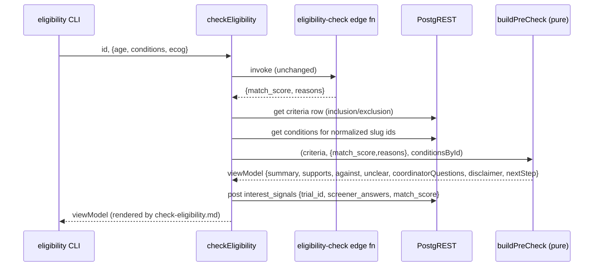

# Design 10-a: Plain-language eligibility pre-check

Design for [spec.md](spec.md). WHICH components exist and WHERE they interact to
turn the raw `{match_score, reasons}` from the `eligibility-check` edge function
into a plain-language self-assessment, at the handler layer, for every surface.

## Problem, restated

The scoring engine (`eligibility-check/mod.ts` `score()`) is correct and stays
untouched (X1). Everything a patient touches speaks protocol language: the
result is a bare enum plus machine `reasons`, and the criteria mix
self-assessable structured rules (age, ECOG, conditions) with verbatim protocol
`custom[]` strings a patient cannot honestly answer. This design adds one
plain-language layer over the existing score, in `checkEligibility`, so the CLI
`eligibility` command — and any future surface on the handler — inherits it.

## The two substrates the design must pin

The reviewers flagged both. Neither is an edge case.

1. **The reason grammar.** The handler only sees the edge function's JSON
   response — it cannot import the Deno scorer. `reasons` is a flat
   `string[]` whose classification lives entirely in exact literals:

   | Exact reason literal (`mod.ts` `score()`)                                                                    | Bucket      |
   | ------------------------------------------------------------------------------------------------------------ | ----------- |
   | `Age N within [min, max]`, `ECOG N <= M`, `Has required condition: S`                                        | supports    |
   | `Age N outside [min, max]`, `ECOG N exceeds max M`, `Missing required condition: S`, `Excluded condition: S` | against     |
   | `Age not provided`, `ECOG not provided`, `Required conditions not provided`                                  | unclear     |
   | `Meets: <custom>`, `Does not meet: <custom>`, `Unanswered: <custom>`, `Excluded: <custom>`                   | coordinator |

   The classifier matches these exact strings, not paraphrases:
   `Required conditions not provided` is plural and must not be conflated with
   the singular against-bucket `Missing required condition: S`. The four
   `<custom>` reasons (`mod.ts:81,144,147,149`) are the complete set the scorer
   emits for `custom[]` rules; **every one routes to coordinator-questions,
   never a self-assessment bucket** (S2/C2). Their fit weight is already folded
   into `match_score`, so suppressing them from the buckets loses no honesty —
   and this holds on every surface, not just the CLI: a future web surface that
   sends `custom_answers` still keeps the custom rule in coordinator-questions.

2. **Slug → readable name is the primary path, not the tail.** `criteria`
   condition tokens are underscore slugs (`lung_cancer`,
   `active_autoimmune_disease`); `condition` entities are hyphen ids
   (`lung-cancer`). Some slugs (`active_autoimmune_disease`,
   `uncontrolled_infection`) have no entity at all. For `oncora-phase3`:
   required `lung_cancer` resolves; excluded `active_autoimmune_disease` does
   not. So the S2 unresolvable-fallback is exercised on the seed anchor itself.

## Components

| Component                          | Where                               | Responsibility                                                                                                                                                                                              |
| ---------------------------------- | ----------------------------------- | ----------------------------------------------------------------------------------------------------------------------------------------------------------------------------------------------------------- |
| `checkEligibility` (extended)      | `handlers/src/check-eligibility.js` | Orchestrate: invoke edge fn (unchanged), `db.get` the `criteria` row and the `conditions` needed to resolve slugs, call the pure builder, insert the **unchanged** anonymous signal, return the view model. |
| `buildPreCheck` (new, pure)        | `handlers/src/eligibility-view.js`  | Pure `(criteria, scoreResult, conditionsById) → viewModel`. Holds the reason-grammar classifier and slug-resolution rule. No I/O — unit-testable like `score()`.                                            |
| `check-eligibility.md` (rewritten) | `handlers/templates/`               | Render the view model as plain language. No raw enum token, no `Age:`/`ECOG max:` label-value lines.                                                                                                        |
| `eligibility` CLI command          | `cli/src/definition.js`             | Already wired to `checkEligibility` + this template. No change.                                                                                                                                             |

## Data flow

## View model

`buildPreCheck` returns one shape the template renders directly:

| Field                                    | Source                                                                                                                                                             | Serves                 |
| ---------------------------------------- | ------------------------------------------------------------------------------------------------------------------------------------------------------------------ | ---------------------- |
| `summary`                                | fixed three-way map over `match_score` → plain sentence                                                                                                            | S3, C3 (no enum token) |
| `supports[]` / `against[]` / `unclear[]` | structured-rule reasons, classified by the grammar; condition slugs replaced by resolved names                                                                     | S1, S3, C3             |
| `coordinatorQuestions[]`                 | authoritatively the `criteria` inclusion + exclusion `custom[]` strings **verbatim**, plus any **unresolvable** condition slug's rule — not the `<custom>` reasons | S2, C2                 |
| `disclaimer`, `nextStep`                 | fixed copy, rendered on all three outcomes                                                                                                                         | S4, C4                 |

## Key decisions

| Decision                              | Choice                                                                                                                                                                                                         | Rejected alternative                                                                                                                                                                                                                                                      |
| ------------------------------------- | -------------------------------------------------------------------------------------------------------------------------------------------------------------------------------------------------------------- | ------------------------------------------------------------------------------------------------------------------------------------------------------------------------------------------------------------------------------------------------------------------------- |
| Classification substrate              | Parse the pinned reason grammar in the pure builder; a builder test fails loudly if a prefix drifts.                                                                                                           | (a) Emit structured reasons from the edge fn — larger blast radius (deployed Deno fn, the web screener at X6 reads the same contract, needs redeploy) and outside the handler-layer scope. (b) Re-derive from criteria+answers — duplicates the scorer, risks divergence. |
| Condition slug rendering              | Normalize `_`→`-`, look up the `conditions` row, use its `name`; unresolvable → coordinator-questions, never a label.                                                                                          | Render the raw slug as a label — fabricates a clinical name, fails the honesty force and X2. Hand-map slugs — violates no-hand-authored-domain-content (X2).                                                                                                              |
| Where readable prompt text comes from | Structured prompts are **rendering patterns over data** (age band, ECOG ceiling, resolved condition name) in the template; `custom[]` strings reproduced verbatim. No per-trial prose authored in `products/`. | Author plain-language rewrites of `custom[]` — X2 violation, risks misstating clinical criteria.                                                                                                                                                                          |
| `custom[]` placement                  | Always coordinator-questions, sourced from the `criteria` `custom[]` arrays verbatim; the scorer's `<custom>` reasons never enter the self-assessment buckets. Holds on every surface.                         | Present `custom[]` as answerable prompts, or place them by reason state — fails C2/S2 and breaks on a surface that sends `custom_answers`.                                                                                                                                |
| Privacy                               | View-model transform is post-score and in-memory; the `interest_signals` insert body stays exactly `{trial_id, screener_answers, match_score}`.                                                                | Record the rendered result — adds a field, fails C5.                                                                                                                                                                                                                      |

## Boundaries

- **Edge function untouched** — X1 holds; the web screener (X6) keeps reading the
  same contract.
- **Clean break** — `check-eligibility.md` is rewritten to the view model, not
  wrapped around the old enum-plus-`reasons` render.
- **Handler + CLI only** — no `site/` change (X6); the shared handler is the
  single home so a later web spec inherits the layer.
- **A second criteria read** — the handler `db.get`s the `criteria` row
  (`criteria?trial_id=eq.<id>&select=inclusion,exclusion`, the shape proven in
  `show-trial.js`) even though the edge fn already read it internally
  (`mod.ts` `fetchCriteria`). The handler cannot import the Deno scorer, so this
  round-trip is the accepted cost of keeping the edge function untouched (X1);
  threading criteria back through the edge response was rejected — it changes
  the deployed contract the web screener reads (X6).
- **Two exclusion booleans stay out** — the scorer never reads
  `exclusion.active_autoimmune` / `prior_immunotherapy`, so they emit no reason,
  and S1 enumerates only age / ECOG / conditions; the pre-check surfaces neither.

## Verification map

Each success criterion lands on the pure builder, a template test, or the CLI —
the harness the existing `check-eligibility.test.js` already establishes.

| Criterion                                                     | Lands on                                                                                               |
| ------------------------------------------------------------- | ------------------------------------------------------------------------------------------------------ |
| C1 (age/ECOG as questions, no label-value lines)              | builder test on `oncora-phase3` shape + template test; `just cli eligibility oncora-phase3` end to end |
| C2 (`custom[]` only in coordinator-questions)                 | builder/template test asserting each `custom[]` string renders only there                              |
| C3 (plain result, no enum token, three buckets)               | template test: no raw enum, per-rule bearing incl. could-not-answer                                    |
| C4 (disclaimer + next step on all outcomes)                   | template test across all three `match_score` values                                                    |
| C5 (no new recorded field, no criterion prose in `products/`) | handler test on the insert body keys; `rg` guard over `products/`                                      |

## Open question for the plan

ECOG is itself jargon. Rendering `ecog_max` as a plain-language performance
line is a fixed data-parameterized pattern (not authored criterion prose), but
the plan must choose the exact wording and pin it in a template test so it stays
honest and does not drift into a clinical claim. This sits inside C1's
"plain-language questions" criterion — it is a wording choice, not new scope.

— Staff Engineer 🛠️
