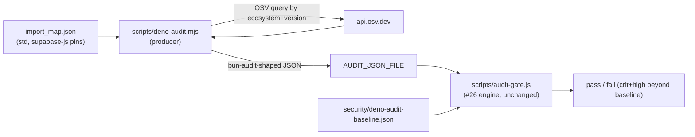

# Design 20-a — Deno version-pin advisory check by reusing the #26 verdict engine

Closes the Deno half of `ci_security_gates_missing` with a **stopgap**: a CI
check that looks up the two top-level Deno pins (`deno.land/std@0.224.0`,
`@supabase/supabase-js@2.110.0`) against an advisory source and fails on an
un-accepted critical/high — the same policy #26 enforces for the npm/bun tree.
It is explicitly **not** a resolved-graph or transitive scan (that is Spec 40).
The CONTRIBUTING `## Security` policy body already landed (#37); this design
delivers the check mechanism (SC1–4) and owns the small doc edit that turns its
Deno paragraph from "planned" to "live" (SC5).

## Architecture — producer feeds the proven verdict engine

The one load-bearing decision: **do not re-implement or refactor the verdict
logic.** `scripts/audit-gate.js` already owns baseline-diff, the critical/high
threshold, `review_by` expiry, deterministic output, and fail-open-on-infra.
It exposes two seams — a baseline path (`argv[2]`) and an `AUDIT_JSON_FILE`
override that replaces its `bun audit` call. A new **Deno advisory producer**
synthesizes the exact JSON shape the engine consumes from a version-pin lookup
and hands it over against a Deno baseline. #26's engine runs unchanged; the two
gates behave identically because they are literally the same verdict code.

## Components and where they live

| Component         | Where                                             | Responsibility                                                                                                                                                         |
| ----------------- | ------------------------------------------------- | ---------------------------------------------------------------------------------------------------------------------------------------------------------------------- |
| Advisory producer | `scripts/deno-audit.mjs` (new)                    | Read the two pins from `import_map.json`; query OSV by ecosystem+version; emit a `bun audit --json`-shaped advisory map (see Interfaces)                               |
| Verdict engine    | `scripts/audit-gate.js` (existing, **unchanged**) | Diff advisories vs baseline, gate on crit/high, `review_by`, fail-open — reused via `AUDIT_JSON_FILE` + baseline-path arg                                              |
| Deno baseline     | `security/deno-audit-baseline.json` (new)         | Mirror of `security/audit-baseline.json` schema; starts empty (`advisories: {}`) since the tree is clean today                                                         |
| CI host           | `.github/workflows/check-audit.yml` (edit)        | New bun-runtime `deno-audit` job alongside the npm gate — inherits its existing PR + push + nightly `schedule` triggers (see D3)                                       |
| Producer test     | `scripts/deno-audit.test.js` (new)                | Assert the OSV→shape mapping against a captured OSV response and the empty/known-vuln verdicts, mirroring `scripts/audit-gate.test.js`                                 |
| Doc edit          | `CONTRIBUTING.md` `## Security`                   | Turn the Deno paragraph present-tense and correct its host reference to `check-audit.yml`; the policy body (threshold, baseline rule, boundary) is already there (#37) |

## Key decisions

| #   | Decision                                                                                            | Why                                                                                                                                                                                                                                                                                                                              | Rejected alternative                                                                                                                                                                                                                                                                                                                                                                                                                                                                                                 |
| --- | --------------------------------------------------------------------------------------------------- | -------------------------------------------------------------------------------------------------------------------------------------------------------------------------------------------------------------------------------------------------------------------------------------------------------------------------------- | -------------------------------------------------------------------------------------------------------------------------------------------------------------------------------------------------------------------------------------------------------------------------------------------------------------------------------------------------------------------------------------------------------------------------------------------------------------------------------------------------------------------- |
| D1  | Reuse `audit-gate.js` unchanged via its `AUDIT_JSON_FILE` + baseline-arg seams; add only a producer | "Behave identically to #26" and "must not weaken any existing gate" are satisfied by definition when it is the same verdict code; no drift, no risk to the live npm gate                                                                                                                                                         | Extract a shared `lib/audit-verdict.js` used by both — cleaner on paper, but editing `audit-gate.js` touches the proven #26 gate the spec forbids weakening. A standalone re-implementation would drift into two policies.                                                                                                                                                                                                                                                                                           |
| D2  | Advisory source = **OSV API** (`POST /v1/query` by `{ecosystem, name}` + version)                   | Needs no landed PURL and no lockfile extractor (the spec's blocker for a graph scanner); `@supabase/supabase-js@2.110.0` resolves cleanly under the `npm` ecosystem                                                                                                                                                              | OSV-Scanner over `deno.lock` — resolves to zero packages on this tree, a false green (spec Problem gap 1). GitHub Advisory API — viable fallback, but a second auth surface; OSV is unauthenticated and PURL-free.                                                                                                                                                                                                                                                                                                   |
| D3  | Host the Deno job in **`check-audit.yml`**, not `check-edge.yml`                                    | #26's gate lives in `check-audit.yml` (bun runtime, and a `17 7 * * *` cron already present, isolated there on purpose so the audit cron never drags lint/test along). Adding a bun `deno-audit` job there matches the engine's runtime, inherits the `review_by` nightly path for free, and touches no existing gate's triggers | **`check-edge.yml`** (the spec's advisory Note) — but that predates #26 shipping as a _separate_ workflow; check-edge is deno-runtime (cross-runtime friction for the bun/node engine) and has no cron, so honoring the Note would either graft a repo-wide `schedule` onto the deno lint/test job (the coupling #26 designed against) or forgo `review_by` fail-loud. **Flagged for the approver: this diverges from the spec Note and the #37 doc host sentence — redirect here if the literal host is required.** |
| D4  | `std@0.224.0` coverage is best-effort and **stated**, never silently passed                         | OSV has no first-class ecosystem for `deno.land/std`; the producer emits a distinct "no advisory source available for std" log line (not "no advisories found") and does not mark std as covered — honoring the no-false-green constraint                                                                                        | Treat an empty OSV result for std as a clean pass — manufactures confidence the spec explicitly forbids ("a false-green gate is worse than no gate").                                                                                                                                                                                                                                                                                                                                                                |

## Interfaces

- **Producer input:** the two `imports` entries in `import_map.json` →
  `{ecosystem, name, version}`. `@supabase/supabase-js` → `npm` /
  `@supabase/supabase-js` / `2.110.0` (parsed from the esm.sh URL); `std/` →
  `deno.land/std` / `0.224.0` (best-effort per D4). `deno.lock` is not a source
  for supabase-js — it carries only `std` (spec Problem gap 1).
- **Producer output — the contract the engine silently trusts.** Top-level
  object `{ "<package>": [ { "url", "severity", "title" } ] }`, exactly what
  `audit-gate.js:flatten()`/`advisoryKey()` consume (see the `audit-gate.test.js`
  fixtures). Two mappings the producer test must pin, because each is a
  false-green or false-red trap:
  - `url` must be the `https://github.com/advisories/GHSA-…` URL (the engine keys
    identity off the last path segment starting `GHSA-`). Select the GHSA
    reference from OSV `aliases`/`references[]` — a non-GHSA URL mis-keys and the
    finding reads as unbaselined (false red).
  - `severity` must be the lowercase enum `critical|high|moderate|low` mapped
    from OSV CVSS / `database_specific.severity` (which is uppercase). Anything
    else lands in the engine's "other" bucket and **never gates** — a false green.
- **Baseline:** `security/deno-audit-baseline.json` — same `_note` / `threshold`
  / `baselined_on` / `advisories{package,severity,title,url,reason,accepted_on,review_spec,review_by}`
  fields as the npm baseline, so one policy covers both.

## Success-criteria traceability

- SC1 (runs on PR + main push) ← D3 job inherits `check-audit.yml`'s triggers
- SC2 (fails on un-accepted crit/high on a pin) ← producer surfaces the OSV
  advisory; engine gates it. Manual verify: pin `supabase-js` to a known-vuln
  version. The producer test asserts this against a **captured** OSV response,
  not a live query, so CI stays hermetic
- SC3 (output + CONTRIBUTING state pins-only boundary, cite Spec 40) ← D4 log
  line + the doc paragraph already present (#37)
- SC4 (green today; gate + baseline land together) ← empty Deno baseline; the
  tree is clean, so the introducing PR is green
- SC5 (policy documented for both gates) ← body already merged (#37); this design
  owns the tense flip and the host-reference correction to `check-audit.yml`
- SC6 (`ci_security_gates_missing` recorded at 0, pins-only note) ← a post-merge
  action by security-engineer once this and #26 are on `main`; no design
  component moves the metric

## Risks

- **OSV → engine shape mapping.** The engine-side shape is pinned by
  `audit-gate.test.js`; the OSV→shape translation is pinned **only** by the new
  producer test, which must therefore assert against a captured real OSV
  response, not a hand-rolled ideal. The two mapping traps above (GHSA url,
  lowercase severity) are where a mis-shape silently flips the verdict.
- **std unmonitored (D4).** A real advisory in `deno.land/std` would not be
  caught until Spec 40 lands `npm:`-style resolution. Disclosed in the check log
  and CONTRIBUTING, not hidden — the honest boundary the spec demands.
- **OSV outage.** Inherits the engine's fail-open posture (warn + exit 0), so an
  OSV outage never red-walls every PR, identical to #26.

— Staff Engineer 🛠️
