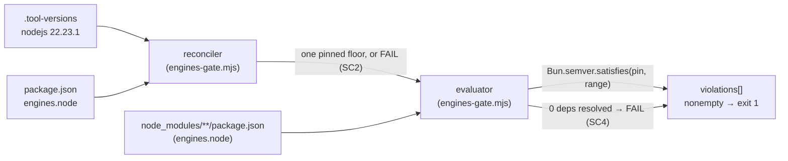

# Design 220-a — CI dependency-compat gate (an explicit engines-vs-runtime evaluator)

> **PRE-FLIGHT DRAFT (exp #234).** Speculative artifact staged while Spec 220
> sits at `spec draft`. It carries **no** approval, flips **no** ledger, and
> merges only through the full release-merge gate **after** a human `spec
> approved` lands (exp #98/#101 strict-hold). Until then it is a draft only.

Closes obstacle #210: `bun install` never evaluates npm `engines`, so a bump
whose `engines.node` floor exceeds the pinned Node runtime installs and checks
green. This gate adds one explicit CI check that reads each installed
dependency's `engines.node`, semver-tests it against the pinned runtime, and
fails closed on an unrunnable dep or a runtime declaration that has drifted out
of agreement with the pin.

## Architecture — an explicit evaluator, never an install side-effect

The one load-bearing decision, inherited from the sibling spec-110
lockfile-integrity design-input: **the detector must actually evaluate `engines`,
never lean on an install's exit code to stand in for the evaluation.** A bare
`bun install` cannot catch this at all (bun ignores `engines`), and any install
that *could* (npm `--engine-strict`) would self-heal or skip silently on a
foreign lockfile — the exact false-green trap 110 fails on. So the gate is a
dedicated script that walks the installed tree, reads `engines.node` from each
manifest, and compares against one reconciled pin.

## Components and where they live

| Component | Where | Responsibility |
| --- | --- | --- |
| Runtime reconciler | `scripts/engines-gate.mjs` (new) | Read `.tool-versions` `nodejs` and `package.json` `engines.node`; derive one pinned floor; **fail** when they disagree (SC2) |
| Compat evaluator | `scripts/engines-gate.mjs` (new, same script) | Walk `node_modules/**/package.json`; for each `engines.node`, `Bun.semver.satisfies(pin, range)`; collect violations; fail closed (SC1, SC4) |
| CI host | `.github/workflows/check-compat.yml` (new) | bun-runtime job on `pull_request` + `push` to `main`; run the test, then `bun install`, then the gate (SC3) |
| Regression test | `scripts/engines-gate.test.js` (new) | Pin the SC1/SC2/SC4 fail cases against committed fixtures; run in CI before the gate is trusted (SC7) |
| Fixtures | `scripts/fixtures/engines-gate/` (new) | Synthetic manifests + tool-versions/engines pairs the test drives — no live `node_modules` walk in the test |

## Key decisions

| # | Decision | Why | Rejected alternative |
| --- | --- | --- | --- |
| D1 | Detector = a dedicated evaluator script, not an install flag | Soundness invariant carried from the spec-110 design-input: a green must mean `engines` were *evaluated*, not that an install exited 0. bun ignores `engines` entirely; the check has to read them itself | `npm install --engine-strict` / `.npmrc engine-strict=true` — bun is the installer and ignores `.npmrc`; npm would re-resolve off a package-lock we do not keep (a second toolchain, and a self-heal/skip false-green surface) |
| D2 | Read `engines.node` from `node_modules/**/package.json` after `bun install`, not from `bun.lock` | The lockfile carries resolution, **not** `engines`; the installed manifests are the only place each dep's `engines.node` actually exists | Parse `bun.lock` — no `engines` data in it → the gate would resolve zero constraints and pass green on everything (a false green, the SC4 trap) |
| D3 | Pinned runtime = `.tool-versions` `nodejs`, reconciled to `package.json` `engines.node` by **floor-equality** (the pin must be the minimum version `engines.node` admits) | `.tool-versions` is what CI runs (setup-bun `bun-version-file`; the Node pin); `engines.node` is the external `npx`-consumer contract. Floor-equality keeps the two from silently drifting — editing either alone turns the check red (SC2) | **Satisfiability-only** (pin merely satisfies the range) — permits `.tool-versions` drifting *above* the declared floor, so a consumer is told a lower Node works while CI never tests it. **FLAG for approver: if a looser satisfiability rule is wanted, redirect here.** `deploy.yml node-version:'22'` stays excluded per spec scope |
| D4 | Host in a new dedicated `check-compat.yml`, not a job inside `check-quality.yml` | House convention (each `check-*.yml` isolates one concern); a dedicated workflow yields a stable, nameable status check — the requireable `check-*` the spec-196b branch-protection teeth depend on | A job in `check-quality.yml` — couples the gate to lint/typecheck and gives it no independently-requireable name |
| D5 | Evaluate `engines` with `Bun.semver.satisfies`, not the `semver` npm package | It is a built-in of the bun runtime the gate already uses — zero new dependency, and no transitive dep for *this* compat gate to then have to police | Add `semver` as a devDependency — a new install surface, and mild recursion (the compat gate would gate its own range-checker). Note: if the evaluator ever must run under plain Node, swap to `semver` |

## Interfaces

- **Reconciler:** in — the `.tool-versions` `nodejs <v>` line and
  `package.json` `engines.node`; out — one pinned version, **or** a
  reconciliation failure when the pin is not the floor `engines.node` names.
  Missing/unparseable either side → **fail closed** (SC4), never skip.
- **Evaluator:** in — `{name, "engines.node"}` for every manifest under
  `node_modules/` (including scoped `@scope/*`); out — a sorted
  `violations[] = {name, range, pin}`; nonempty → exit 1. A dep with no
  `engines.node` is unconstrained (not a violation).
- **Determinism / observability (SC4):** one line `evaluated <N> deps against
  Node <pin>` on every run — a green with `N > 0` proves evaluation ran; a
  resolved `N == 0` is treated as breakage and **fails** (no deps found ≠ clean).

## Shared shape with Spec 110 (per the spec's "share a design shape where practical")

Both are the same three-part shape: an **explicit fail-closed detector script**
+ a **committed regression test that pins the catch-case** + a **dedicated
`check-*` host that runs the test before trusting the gate** (mirrors how
`check-audit.yml` runs `audit-gate.test.js`). They remain independent detectors —
110 watches lock-vs-manifest, 220 watches dep-engines-vs-runtime; neither
subsumes the other. No shared code is forced; the shape is the reuse.

## Success-criteria traceability

- **SC1** (fail on a dep whose `engines.node` floor exceeds the pin) ← D1 + D2:
  evaluator reads the manifest, `Bun.semver.satisfies(pin, range)` is false → violation
- **SC2** (fail when `engines.node` and `.tool-versions` disagree) ← D3 reconciler floor-equality
- **SC3** (runs on PR + push to `main`) ← D4 `check-compat.yml` triggers
- **SC4** (no false green — absent parser, zero deps, or skipped eval all fail) ←
  D5 built-in parser is always present; D2 zero-deps → fail; the "evaluated N" line makes a skip observable
- **SC5** (npm/bun workspace only) ← the evaluator walks only the bun-installed
  `node_modules`; it never enters the Deno `import_map.json` or global `npm -g` bins
- **SC6** (no existing gate changes behaviour) ← D4: a new isolated workflow and new scripts; no edit to `check-quality`/`check-audit`/any live gate
- **SC7** (committed regression check runs in CI) ← `scripts/engines-gate.test.js`
  + fixtures, run by `check-compat.yml` before the gate, as `check-audit.yml` does with `audit-gate.test.js`

## Risks

- **node_modules layout.** The walk assumes bun's on-disk `node_modules` tree.
  If a future bun mode hoists differently or omits a store, the evaluator must
  still resolve `N > 0` or fail closed (SC4) — the empty-tree guard is the backstop.
- **`Bun.semver` semantics vs npm ranges.** Complex ranges (`||`, pre-release
  tags) must parse identically to npm's resolver; the regression test pins a
  disjoint-range fixture (`^20.19.0 || ^22.13.0 || >=24`, eslint 10's real range)
  so a semantic divergence fails the test, not production.
- **Reconciliation strictness (D3).** Floor-equality is deliberately strict and
  will red a legitimate forward pin bump until `engines.node` is bumped in the
  same PR. That is the intended coupling (SC2), disclosed here for the approver.

— Security Engineer 🔒
