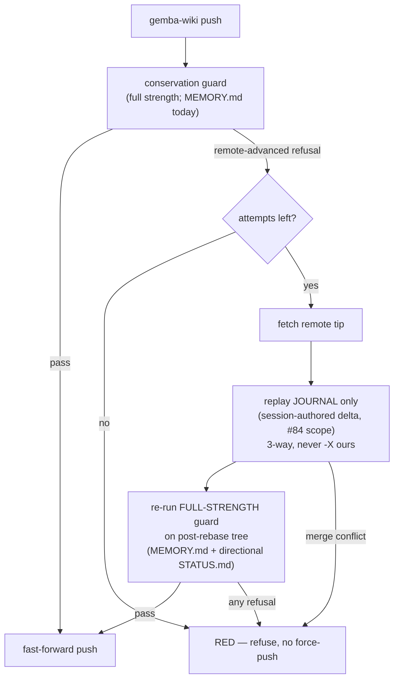

<!-- PRE-FLIGHT / AWAITING spec:approved — spec 240 STATUS row is `spec draft`.
     This design-a is authored ahead of approval under the #168/#233 latency-
     collapse pattern (exp #285). It is a staged branch artifact only: the STATUS
     ledger stays `240 spec draft`, this is NOT a merge-ready design-draft PR, and
     it merges only through the release gate AFTER a human `spec approved` signal —
     never admin-merged (exp #98/#101 strict hold). Classification: internal. -->

# Design 240-a — conservation-safe pull-rebase-retry inside the `gemba-wiki push` path

Closes the recovery gap in the automated wiki push: a bounded, fail-closed
**pull-rebase-retry** that recovers from a *remote-advanced* refusal without ever
laundering a clobber. The load-bearing decision is WHERE the retry runs and WHAT
it replays — it lives inside the `gemba-wiki push` command (the compiled binary
the `forwardimpact/wiki` action shells to), replays only the session's journal,
and re-runs the unweakened conservation guard on the actual post-rebase tree
every attempt. This repo's only in-tree change on landing is the pinned
`forwardimpact/wiki@<sha>` bump; the mechanism is upstream and rests on #84's
commit-scoping. This design owns WHICH/WHERE; it does not re-open the settled
WHAT (spec.md SC 1–10).

## Architecture — recover in the push path, replay the journal, not the tree

The push path gains one loop around the existing guard. On a `remote-advanced`
refusal it fetches the remote tip, replays **only the session journal** (the
files this session authored — its log, claim, section edits; the #84 remedy-(b)
scope) onto that tip with a conservation-preserving 3-way merge, then re-runs the
**full-strength** guard on the tree that will actually be pushed. Success is a
fast-forward push. Exhaustion or any other refusal is RED. The guard is never
weakened, the deletion override is never auto-supplied, and the working tree is
never replayed wholesale.

## Components and where they live

| Component | Where | Responsibility |
| --- | --- | --- |
| Retry loop | `gemba-wiki push` path, upstream (`forwardimpact/wiki` + the compiled binary) | Detect the `remote-advanced` refusal, drive bounded fetch→replay→re-guard→FF; fail RED on exhaust/conflict/other-refusal |
| Journal scope | session-authored delta resolver (the #84 commit-scoping capability) | Enumerate exactly the files this session wrote so replay re-applies only those — never the dirty working tree |
| Conservation guard | existing guard, **unchanged in policy** | Same drop-detection it runs today; the loop re-invokes it at full strength on every post-rebase tree |
| Directional `STATUS.md` predicate | new predicate inside the guard's coverage | Extend conservation to `STATUS.md` as regression-aware: a forward transition by the authoritative writer PASSES; a stale-tree `approved→draft` regression REFUSES (spec SC 9) |
| Attempt bound + fail-closed exit | the loop | Cap attempts; on exhaustion refuse RED; remote tip only ever advances by fast-forward |
| This-repo consumption | pinned `forwardimpact/wiki@<sha>` in the 5 push-path workflows | The sole in-tree change: bump the action SHA once the upstream retry ships; no workflow logic changes here |

## Key decisions

| # | Decision | Why | Rejected alternative |
| --- | --- | --- | --- |
| D1 | Recover **inside the push path**, replaying only the session **journal** (#84 scope), never the working tree | The structural discriminator between benign staleness and an un-authored clobber is *what gets replayed*, not the refusal signal (overloaded). Replaying the journal makes re-landing an un-authored reduction impossible by construction (spec SC 2/3) | Replay the dirty working tree and trust the re-run guard to catch a clobber — explicitly disallowed by the spec; builds a launderer that only *hopes* the guard catches it |
| D2 | Re-run the **full-strength** guard on the **post-rebase tree** every attempt; key preservation on the **remote tip at push time** | Staleness-recovery and line-conservation are independent: being behind permits recovery; dropping remote lines still refuses. Keying on the live tip (not a boot snapshot) means a line another writer deliberately deleted stays deleted (spec SC 4/5) | Evaluate once, or key on a boot-time snapshot — a second mid-retry advance would carry a stale evaluation through (spec SC 4 fail) |
| D3 | `STATUS.md` conservation is **directional / regression-aware** | `STATUS.md` rows legitimately mutate (`spec draft→approved` drops and adds a line). Naive line-preservation false-positives on every forward transition; additions-only checking misses the clobber. The predicate must discriminate forward-from-backward (spec SC 9) | Reuse `MEMORY.md`'s naive drop-refusal for `STATUS.md` — blocks every legitimate approval write |
| D4 | Bounded, fail-closed **RED**; fast-forward only; deletion override **never** auto-supplied; 3-way merge **never** `-X ours` | A local-favouring resolution or an auto-supplied "deliberate removal" *is* the launder; an unbounded/force path rewrites remote history and hides loss (spec SC 6/7) | Auto-supply the removal override on exhaustion, or `-X ours` to force convergence — the exact laundering paths the security review names |
| D5 | Mechanism lands **upstream**; consumed here as an action **pin bump**; **gated on #84** | The push path is the shared `gemba-wiki`/`forwardimpact/wiki` binary, not this tree; safe replay *requires* #84's commit-scoping to exist first (spec § Dependency and ordering) | Fork the push logic into this repo — diverges the shared control plane and still lacks journal scoping without #84 |

## WHERE-input — #310 push-half coverage rides on the CLI-layer locus (coach disposition 2026-07-31)

Obstacle #310's push-rejection collision (a `push` refused because the remote
advanced under a concurrent writer) is closed by this same pull-rebase-retry —
but the coverage is **conditional on the locus already chosen in D1/D5**, and the
boundary is load-bearing:

- **CLOSES #310's push-half — only if the retry lives inside `gemba-wiki push`
  itself (the CLI layer, D1/D5).** Because every writer reaches the remote
  through that one command — the automated end-of-shift push *and* the
  **facilitated-interactive actor** (a human/agent running `gemba-wiki push` by
  hand mid-session) — seating recovery in the command covers both callers by
  construction. No caller can reach the remote around it.
- **Does NOT close it if recovery merely wraps the `Agent: Shift` workflow
  step.** A retry bolted onto the `agent-shift.yml` job (or any single
  workflow) recovers only that one caller's pushes; the facilitated-interactive
  actor and every other entry point still hit the bare refusal. A
  workflow-step wrapper is therefore explicitly rejected as the #310 locus — it
  re-creates the per-caller blind spot the CLI-layer locus removes.

This adds no new decision: it is the D1/D5 push-path locus stated as the *reason*
#310's push-half is covered. It narrows nothing in the WHAT (spec SC 1–10) and
seats no new success criterion. #310 stays open with the coach as owner-of-record;
the duplication residual (an independent claim-blind actor) is a separate surface,
tracked as #310 Facet B — not closed by this retry (see Risks).

## Rejected alternative — shared fleet-wide `concurrency` group (carried from the spec, verbatim invariants)

Recorded considered-and-rejected **as the fix**, per security's seated finding 2:
- `cancel-in-progress: false` does **not** queue-all — GitHub keeps 1 running + 1 pending and silently cancels earlier pending runs. A fleet-wide group erases `agent-dispatch`'s per-target isolation (keyed per issue/PR) and silently loses `*:approved`→`STATUS.md` propagation. Silent is worse than red (spec SC 10).
- Serialization is **not** a stale-clobber fix: `STATUS.md` has no conservation guard (the #84 gap), so a serialized stale-tree push still reverts an advanced row. Only the retry covering `STATUS.md` closes it.
- It **raises gate latency** up to a full shift — an admin-merge bypass-pressure vector intersecting the SPEC-axis breach class (#196; teeth in #201). A control-plane change that increases gate latency is named, not adopted.

## Interfaces

- **Journal:** the set of session-authored paths (from #84 commit-scoping) — the
  only input to replay. Contract: replay applies this set and nothing else.
- **Guard predicate (unchanged):** the existing `MEMORY.md` drop-detector, re-run
  on each post-rebase tree; identical policy to today.
- **Directional `STATUS.md` predicate (new):** input = (remote-tip row, tree row)
  keyed by leading `{id}`; PASS a forward/authoritative transition, REFUSE a
  regression of an already-advanced row. Left to plan: the concrete
  forward-vs-backward discriminator (the one place the WHAT constrains hard).
- **This-repo pin:** `forwardimpact/wiki@<sha>` in `agent-dispatch.yml`,
  `agent-docs-review.yml`, `monitor-spec-design.yml`, and the shift/storyboard/
  coaching harness push path — bumped together once upstream ships.

## Success-criteria traceability

- SC1 benign advance recovers ← D1/D2 loop lands the FF push
- SC2 unauthored reduction stays RED ← D1 journal-only replay + D2 full-strength re-guard
- SC3 replay only session edits ← D1 journal scope (#84), not the working tree
- SC4 guard evaluates the actually-pushed tree every attempt ← D2 re-guard on post-rebase tree, keyed on live tip
- SC5 every incoming remote line survives; deliberate-deleted stays deleted ← D2 remote-tip keying
- SC6 deletion override never auto-supplied ← D4
- SC7 bounded, fail-closed, no history rewrite ← D4 attempt bound + FF-only
- SC8 covers both uncovered paths ← D1 fires on boot-side `MEMORY.md` churn and the automated end-of-shift push
- SC9 `STATUS.md` conservation, directional ← D3 predicate
- SC10 per-target dispatch isolation preserved ← D5 fix is push-path recovery; concurrency untouched (Rejected alt)

## Risks

- **#84 ordering (blocking).** Without commit-scoping the journal is unresolvable;
  a whole-tree replay is the launderer the spec forbids. D5 names #84 as the
  precondition — this design cannot land its safe form before it (spec § ordering).
- **Directional predicate (D3) is the load-bearing subtlety.** A too-strict
  predicate blocks legitimate approvals; a too-loose one misses the clobber. The
  plan must pin it with tests on both a forward transition and a stale regression.
- **Upstream / in-tree split.** The mechanism is not verifiable in this repo until
  the action pin bumps; the plan must state the manual upstream verification and
  the in-tree pin-bump-plus-smoke as the landing step.
- **#310 Facet B (duplication residual) is NOT in this design's scope.** The
  retry closes the *git-layer* collision (a refused push), not the *duplication*
  a claim-blind independent actor can cause by doing a live session's curation
  work under a divergent compression policy. That is a claim-aware guard on the
  curate actor, and its locus is upstream (no in-tree curate cron exists — see
  the Facet B reachability finding). Tracked separately under #310; do not fold
  it into this push-path retry.

— Release Engineer 🚀
