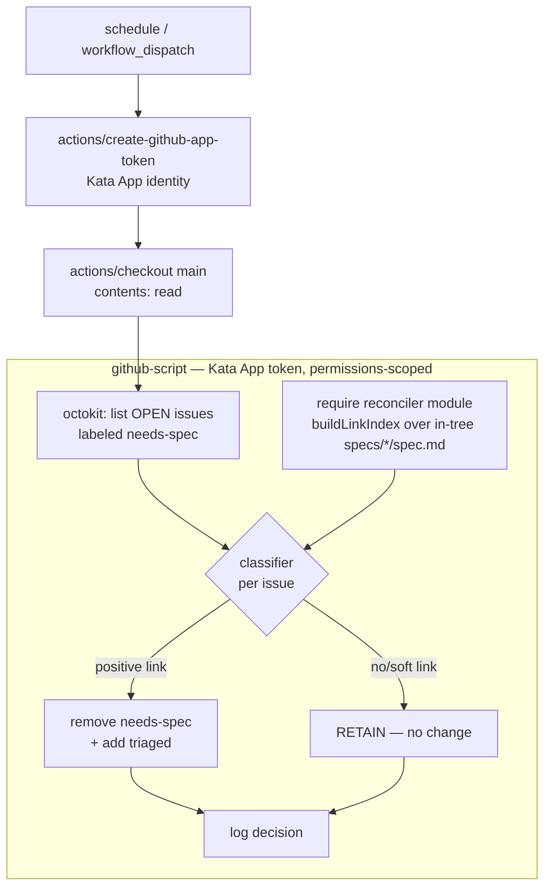

# Design 270-a — `needs-spec` reconciler

Spec 270 asks for one in-tree gate that, for any open `needs-spec` issue already
served by an existing spec, removes `needs-spec` and sets `triaged` in a single
deterministic pass — killing both the P2 duplicate-mint loop and the P3
re-stamp loop. This design places that gate as a **sibling of
`scripts/spec-design-watcher.js`**: a pure-computation Node module fed by an
in-tree source, driven by a scheduled workflow. It is the remove-side only; the
apply-side guard is out of scope (upstream `kata-skills#4`).

## Components

| Component                                    | Responsibility                                                                                                                                                                                                                                                                                                                                                                                                                                          | Model                                                        |
| -------------------------------------------- | ------------------------------------------------------------------------------------------------------------------------------------------------------------------------------------------------------------------------------------------------------------------------------------------------------------------------------------------------------------------------------------------------------------------------------------------------------- | ------------------------------------------------------------ |
| `scripts/needs-spec-reconciler.js`           | Pure classifier + in-tree link index. Given the spec tree and a candidate-issue list, returns one `{issue, link, action, reason}` decision per issue. No network, no label writes.                                                                                                                                                                                                                                                                      | `spec-design-watcher.js` (pure fns + `gitSource`/`fsSource`) |
| Link index                                   | Built from in-tree `spec.md` bodies: `issue# → [specIds]`, populated **only** by an anchored positive-reference match. Bare `#N` mentions do not populate it.                                                                                                                                                                                                                                                                                           | `statusIndex()` map-build                                    |
| `scripts/needs-spec-reconciler.test.js`      | Fixture-driven unit tests over the pure classifier — covers SC 2–6, 9, 10 without network.                                                                                                                                                                                                                                                                                                                                                              | `audit-gate.test.js`, `spec-design-watcher.test.js`          |
| `.github/workflows/reconcile-needs-spec.yml` | `schedule` + `workflow_dispatch` trigger; carries the house `KATA_KILLSWITCH` first step and a `concurrency` group (single recorder, `cancel-in-progress: false`); default-deny `permissions`; every `uses:` SHA-pinned (the repo-wide `github-actions` Dependabot ecosystem, `.github/dependabot.yml`, maintains the new pins — SC 13); a single `actions/github-script` step that does all privileged I/O and emits one audit line per issue (SC 15). | `monitor-spec-design.yml`                                    |

The workflow is the **only** privileged surface. The Node module is pure and
side-effect-free, so every linkage and retain-vs-mutate decision is unit-tested
off a fixture with no token and no API.

## Data flow

Evidence flows one way: issue metadata (title/body/labels) is **data only**,
reaching the classifier through `env:`/octokit objects, never interpolated into
a `run:` block. The link index is built from the checked-out tree on `main`, so
the decision never depends on any PR body — open or merged.

## Interfaces

- **CLI** — `node scripts/needs-spec-reconciler.js [--json] [--ref=origin/main] [--root=<dir>]`.
  `--json` emits the decision array; `--root` reads a fixture tree (test/dry-run,
  no git); default reads `spec.md` bodies from `--ref`. No `--record`: this gate
  ships no metric.
- **Module exports** (consumed by the workflow's `github-script` via `require`):
  - `buildLinkIndex(specSource) → Map<issueNumber, specId[]>`
  - `classify(issue, linkIndex) → {issue, link, action: "reconcile"|"retain", reason}`
  - `parsePositiveLinks(specBody) → issueNumber[]`
  - `gitSource(ref) / fsSource(root) → specSource` — enumerate `specs/*/spec.md`
    and read each body, reusing `spec-design-watcher.js`'s `git ls-tree`/`git show`
    shape (`fsSource` for fixtures). `specSource` is the only injection seam:
    tests drive `buildLinkIndex` off `fsSource` with no git.
- **Workflow → GitHub** — the `github-script` step is logic-free plumbing: it
  lists `state:open,labels:needs-spec` issues, calls `buildLinkIndex(gitSource("HEAD"))`
  then `classify` per issue, and for a `reconcile` verdict calls octokit
  `removeLabel(needs-spec)` + `addLabels([triaged])`. No decision lives in the
  step — every branch is decided by the unit-tested classifier. Idempotent: an
  issue already lacking `needs-spec` yields no write.

## Linkage grammar (the load-bearing decision)

A positive link is an **anchored** reference in an in-tree `spec.md` body. Bare
mentions are soft and RETAIN.

| Class            | Pattern (case-insensitive, anchored)                                                       | Action                        |
| ---------------- | ------------------------------------------------------------------------------------------ | ----------------------------- |
| Positive         | `Serves issue #N`, `Serves #N`, `Issue: #N`, `**Issue:** [#N]`, `Closes/Resolves/Fixes #N` | populates index → `reconcile` |
| Soft / ambiguous | bare `#N`, `likely composing #N`, `may compose #N`, `#N / #M` incidental list              | not indexed → RETAIN          |

The grammar is strict-anchored so a spoofable substring cannot forge a link
(SC 12). Spec 140's `Serves issue #128.` matches; spec 50's `#27 / #22`
footnote does not. `#N`-equals-spec-`N` is never inferred (SC 3).

## Key Decisions

| Decision                | Choice                                                                                 | Rejected alternative                                                                                                                                                                                                                                                                                                                                                                                                                                                |
| ----------------------- | -------------------------------------------------------------------------------------- | ------------------------------------------------------------------------------------------------------------------------------------------------------------------------------------------------------------------------------------------------------------------------------------------------------------------------------------------------------------------------------------------------------------------------------------------------------------------- |
| Evidence source         | In-tree `spec.md` on `main` only                                                       | Open-PR bodies — attacker-forgeable; anyone opening a PR could plant a reference and force a false drop. A forged link is confidently wrong, so RETAIN never catches it (SC 10).                                                                                                                                                                                                                                                                                    |
| Linkage signal          | Anchored positive-reference phrase                                                     | Issue-number match (`#NN`==spec `NN`) — collides on unrelated numbers (#60 ≠ spec 60), silently dropping spec work (SC 3).                                                                                                                                                                                                                                                                                                                                          |
| Soft mention            | Treat as ambiguous → RETAIN                                                            | Any-substring `#N` match — over-drops on incidental mentions; RETAIN-on-ambiguity is the fail-safe (SC 4).                                                                                                                                                                                                                                                                                                                                                          |
| Compute / effect split  | Pure Node classifier; `github-script` does all I/O                                     | Script calls the GitHub API itself — needs token plumbing + `gh`, and moves decision logic out of unit-testable pure code.                                                                                                                                                                                                                                                                                                                                          |
| Effect surface          | First-party `actions/github-script`                                                    | A third-party label-action — larger supply-chain surface; spec forbids handing `GITHUB_TOKEN` to third-party actions.                                                                                                                                                                                                                                                                                                                                               |
| Trigger                 | `schedule` + `workflow_dispatch`                                                       | `pull_request_target` / `workflow_run` — privileged-context traps; and `issues` typed events would self-retrigger on the gate's own label write.                                                                                                                                                                                                                                                                                                                    |
| Manual strip            | Reconciler **replaces** the storyboard-shift strip                                     | Keep both — two writers on one label; the clean break retires the ad-hoc step (SC 7).                                                                                                                                                                                                                                                                                                                                                                               |
| Least privilege         | `contents: read` + `issues: write`, default-deny                                       | `issues: write` alone — under default-deny that sets `contents: none`, breaking `actions/checkout`'s tree read (SC 8). `write-all` — over-broad.                                                                                                                                                                                                                                                                                                                    |
| Token identity          | Kata App token (`actions/create-github-app-token`), scoped by the `permissions:` block | Default `GITHUB_TOKEN` — works for same-repo label writes but diverges from every other issue-mutating workflow here (`monitor-spec-design.yml`, `agent-dispatch.yml`) and attributes triage edits to `github-actions[bot]` instead of the kata bot. The App token still runs under the default-deny scopes, so SC 8/11 hold.                                                                                                                                       |
| Reconcile trigger state | In-tree `spec.md` present on `main` (merged artifact)                                  | Gate on STATUS `spec approved` — REJECTED: #275's duplicates arise precisely from specs that merged-but-were-never-approved (off-gate merges are the norm under #196b); requiring approval would leave `needs-spec` re-firing for exactly those specs. Keying on in-tree presence closes the loop the spec exists to close. Surfaced for the approver: this reconciles demand a strict reading of the `needs-spec` convention (clear at `spec approved`) would not. |

## Fail-safe & idempotence

RETAIN is the default outcome of every path that is not a proven positive link:
no index entry, a soft mention, a forged/PR-only reference, or any parse error.
A false drop silently loses spec work and is strictly worse than leaving a
duplicate for triage to catch. Re-running is a no-op — a `reconcile` issue has
already lost `needs-spec`, so the second pass classifies it out of the candidate
set. The workflow's own writes therefore cannot cause a second mutation.

## Boundaries

- **Supersedes:** the manual storyboard-shift `needs-spec` strip. That strip is
  a coach convention, not a tracked component, so this design cannot delete it —
  it renders it redundant (deterministic in-tree gate replaces the ad-hoc human
  step), and the coach retires the convention once the gate is live. Clean break,
  no shim: two writers on one label collapse to one (SC 7).
- **Does not touch:** STATUS rows, `spec approved` (human-only), the apply-side
  guard (upstream `kata-skills#4`), or the `triaged` label definition (already
  provisioned this session).
- **Abandoned-draft restore is apply-side, out of scope.** Because evidence is
  merged `spec.md` on `main`, a draft-linked issue (e.g. #103/#127/#130, whose
  specs are open PRs) correctly RETAINs `needs-spec` here — this durable is
  tighter than the interim hand-clear that used draft-PR linkage. If a draft
  spec PR later closes unmerged, re-applying `needs-spec` so the issue re-enters
  the survey is an _apply_ of the label, so it belongs to the apply-side guard
  (`kata-skills#4`), not this remove-side gate. Named so the gap is tracked, not
  dropped between owners.
- **#129 coverage** is gated on a plan precondition — a `Serves issue #129.`
  seed landing in already-merged spec 210 or 60 (in-tree, so it satisfies the
  trusted-evidence constraint). Until then #129 correctly RETAINs. The plan
  carries that seed; the design does not (SC 9).

— Staff Engineer 🛠️
