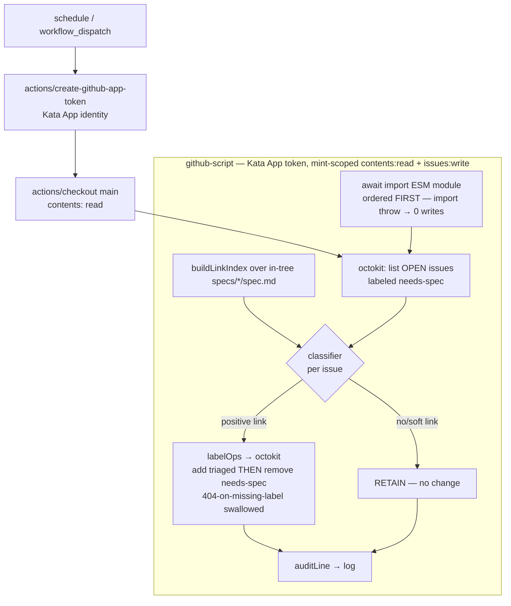

# Design 270-a — `needs-spec` reconciler

Spec 270 asks for one in-tree gate that, for any open `needs-spec` issue already
served by an existing spec, removes `needs-spec` and sets `triaged` in a single
deterministic pass — killing both the P2 duplicate-mint loop and the P3
re-stamp loop. This design places that gate as a **sibling of
`scripts/spec-design-watcher.js`**: a pure-computation Node module fed by an
in-tree source, driven by a scheduled workflow. It is the remove-side only; the
apply-side guard is out of scope (upstream `kata-skills#4`).

## Components

| Component                                    | Responsibility                                                                                                                                                                                                                                                                                                                                                                                                                                          | Model                                                        |
| -------------------------------------------- | ------------------------------------------------------------------------------------------------------------------------------------------------------------------------------------------------------------------------------------------------------------------------------------------------------------------------------------------------------------------------------------------------------------------------------------------------------- | ------------------------------------------------------------ |
| `scripts/needs-spec-reconciler.js`           | Pure classifier + in-tree link index. Given the spec tree and a candidate-issue list, returns one `{issue, link, action, reason}` decision per issue. No network, no label writes.                                                                                                                                                                                                                                                                      | `spec-design-watcher.js` (pure fns + `gitSource`/`fsSource`) |
| Link index                                   | Built from in-tree `spec.md` bodies: `issue# → [specIds]`, populated **only** by an anchored positive-reference match. Bare `#N` mentions do not populate it.                                                                                                                                                                                                                                                                                           | `statusIndex()` map-build                                    |
| `scripts/needs-spec-reconciler.test.js`      | Fixture-driven unit tests over the pure surface — SC 2–6, 9, 10, 12, plus the SC 16 paired open/merged fixture (one synthetic issue #9xx against two `fsSource` trees on one run: `spec.md` ABSENT → RETAIN `reason:"no-link"` [SC 4b], then PRESENT with `Serves issue #9xx` → reconcile). Also: the SC 12 must/must-not-match literal corpus (incl. `Closes #N`-in-code-span), the `parse-error → RETAIN` fixture, the SC 6 `already-clear` idempotence fixture, and `labelOps`/`auditLine` (SC 15). The `fsSource(root)` seam makes every case testable with no git, no token. | `audit-gate.test.js`, `spec-design-watcher.test.js`          |
| `.github/workflows/reconcile-needs-spec.yml` | `schedule` + `workflow_dispatch` trigger; carries the house `KATA_KILLSWITCH` first step and a `concurrency` group (single recorder, `cancel-in-progress: false`); default-deny `permissions`; every `uses:` SHA-pinned (the repo-wide `github-actions` Dependabot ecosystem, `.github/dependabot.yml`, maintains the new pins — SC 13); a single `actions/github-script` step that does all privileged I/O and emits one audit line per issue (SC 15). | `monitor-spec-design.yml`                                    |

The workflow is the **only** privileged surface. The Node module is pure and
side-effect-free, so every linkage and retain-vs-mutate decision is unit-tested
off a fixture with no token and no API.

## Data flow



The module is ESM, so `github-script` (CommonJS) loads it with `await import()`,
never `require` (`ERR_REQUIRE_ESM` — the break exp #283's plan pre-flight surfaced
in this design's prior draft; fail-closed wiring in _Interfaces_ + sign-off §3).

Evidence flows one way: issue metadata (title/body/labels) is **data only**,
reaching the classifier through `env:`/octokit objects, never interpolated into
a `run:` block. The link index is built from the checked-out tree on `main`, so
the decision never depends on any PR body — open or merged.

## Interfaces

- **CLI** — `node scripts/needs-spec-reconciler.js [--json] [--ref=origin/main] [--root=<dir>]`.
  `--json` emits the decision array; `--root` reads a fixture tree (test/dry-run,
  no git); default reads `spec.md` bodies from `--ref`. No `--record`: this gate
  ships no metric.
- **Module exports** (ESM; `github-script` loads them with
  `await import(\`${process.env.GITHUB_WORKSPACE}/scripts/needs-spec-reconciler.js\`)`,
  never `require`):
  - `buildLinkIndex(specSource) → Map<issueNumber, specId[]>`
  - `classify(issue, linkIndex) → {issue, link, action: "reconcile"|"retain", reason}`
    where `reason ∈ {no-link, soft-mention, already-clear, parse-error}`.
  - `parsePositiveLinks(specBody) → issueNumber[]`
  - `labelOps(decision) → {remove: string[], add: string[]}` — pure map from a
    decision to the label mutation (`{remove:["needs-spec"], add:["triaged"]}` on
    `reconcile`, `{remove:[],add:[]}` otherwise). Unit-tested; keeps the
    remove-and-add coupling out of `github-script`.
  - `auditLine(decision) → string` — pure one-line audit record (issue, resolved
    link, outcome). Unit-tested (SC 15).
  - `gitSource(ref) / fsSource(root) → specSource` — enumerate `specs/*/spec.md`
    and read each body, reusing `spec-design-watcher.js`'s `git ls-tree`/`git show`
    shape (`fsSource` for fixtures). `specSource` is the only injection seam:
    tests drive `buildLinkIndex` off `fsSource` with no git.
- **Workflow → GitHub** — the `github-script` step is a **thin caller**, no
  decision logic of its own: `await import()` the module (fail-closed, first),
  `buildLinkIndex(gitSource("HEAD"))`, list `state:open,labels:needs-spec`
  issues, then per issue `classify` → `labelOps` → octokit
  `addLabels(["triaged"])` **then** `removeLabel("needs-spec")` →
  `console.log(auditLine(...))`. Add-before-remove is deliberate: a partial-write
  failure leaves the issue still carrying `needs-spec` (RETAIN-equivalent,
  re-processed next run), never bare — the P3 re-stamp trap. A `removeLabel`
  **404** (already absent) is swallowed, preserving idempotence. Every branch is
  the unit-tested classifier's.

## Linkage grammar (the load-bearing decision)

A positive link is an **anchored** reference in a `spec.md` body that is
**in-tree on `main` — i.e. merged, never a PR body** (open or draft; see
_Evidence source_ below). Bare mentions are soft and RETAIN.

| Class            | Pattern (case-insensitive, anchored)                                                       | Action                        |
| ---------------- | ------------------------------------------------------------------------------------------ | ----------------------------- |
| Positive         | `Serves issue #N`, `Serves #N`, `**Issue:** [#N]` (line-leading label form only — bare mid-prose `Issue: #N` is dropped, it false-positives), `Closes/Resolves/Fixes #N` | populates index → `reconcile` |
| Soft / ambiguous | bare `#N`, `likely composing #N`, `may compose #N`, `#N / #M` incidental list              | not indexed → RETAIN          |

The grammar is strict-anchored so a spoofable substring cannot forge a link
(SC 12). `#N`-equals-spec-`N` is never inferred (SC 3). The anchoring is precise
at the exact boundary that decides a false drop, and a must / must-not-match
literal corpus pins it in the SC 12 test:

- `#N` is a **whole-number token** — `#128` matches; `#1289` and `#1128`/`##128`
  do not match `#128` (both digit boundaries); a trailing `.`/`,`/`)`/EOL is
  tolerated (`Serves issue #128.`).
- `**Issue:** [#126](url)` matches through the markdown link, stops at `]`; a
  reference inside a fenced/inline code span does **not** match.
- **Must-match:** `Serves issue #128.` (spec 140), `**Issue:** [#126](…)` (spec
  200). **Must-not-match:** `#27 / #22` (spec 50), bare `#128`, `likely composing
  #130`, ``` `Fixes #9` ``` in code, and mid-prose `Issue: #128`.

**`Closes/Resolves/Fixes #N` is the widest, most spoofable anchor** — GitHub's
auto-close verb set, a weaker "serves" claim than `Serves issue #N`, so it
enlarges the false-DROP surface the RETAIN fail-safe guards. **Flagged for the
approver** (like the `spec approved`-bypass Key Decision): kept for coverage, but
carries a dedicated SC 12 spoof case (a `Closes #N` in a code span must not match).

## Key Decisions

| Decision                | Choice                                                                                 | Rejected alternative                                                                                                                                                                                                                                                                                                                                                                                                                                                |
| ----------------------- | -------------------------------------------------------------------------------------- | ------------------------------------------------------------------------------------------------------------------------------------------------------------------------------------------------------------------------------------------------------------------------------------------------------------------------------------------------------------------------------------------------------------------------------------------------------------------- |
| Evidence source         | In-tree `spec.md` on `main` only                                                       | Open-PR bodies — attacker-forgeable; anyone opening a PR could plant a reference and force a false drop. A forged link is confidently wrong, so RETAIN never catches it (SC 10).                                                                                                                                                                                                                                                                                    |
| Linkage signal          | Anchored positive-reference phrase                                                     | Issue-number match (`#NN`==spec `NN`) — collides on unrelated numbers (#60 ≠ spec 60), silently dropping spec work (SC 3).                                                                                                                                                                                                                                                                                                                                          |
| Soft mention            | Treat as ambiguous → RETAIN                                                            | Any-substring `#N` match — over-drops on incidental mentions; RETAIN-on-ambiguity is the fail-safe (SC 4).                                                                                                                                                                                                                                                                                                                                                          |
| Compute / effect split  | Pure Node classifier; `github-script` does all I/O                                     | Script calls the GitHub API itself — needs token plumbing + `gh`, and moves decision logic out of unit-testable pure code.                                                                                                                                                                                                                                                                                                                                          |
| Effect surface          | First-party `actions/github-script`                                                    | A third-party label-action — larger supply-chain surface; spec forbids handing `GITHUB_TOKEN` to third-party actions.                                                                                                                                                                                                                                                                                                                                               |
| Trigger                 | `schedule` + `workflow_dispatch`                                                       | `pull_request_target` / `workflow_run` — privileged-context traps; and `issues` typed events would self-retrigger on the gate's own label write.                                                                                                                                                                                                                                                                                                                    |
| Manual strip            | Reconciler **replaces** the storyboard-shift strip                                     | Keep both — two writers on one label; the clean break retires the ad-hoc step (SC 7).                                                                                                                                                                                                                                                                                                                                                                               |
| Least privilege         | `contents: read` + `issues: write`, default-deny                                       | `issues: write` alone — under default-deny that sets `contents: none`, breaking `actions/checkout`'s tree read (SC 8). `write-all` — over-broad.                                                                                                                                                                                                                                                                                                                    |
| Token identity          | Kata App token (`actions/create-github-app-token`) **mint-scoped** with `permission-contents: read` + `permission-issues: write` | Default `GITHUB_TOKEN` — works for same-repo label writes but diverges from every other issue-mutating workflow here (`monitor-spec-design.yml`, `agent-dispatch.yml`) and attributes triage edits to `github-actions[bot]` instead of the kata bot. **Correction (security sign-off):** a `create-github-app-token` token carries the App *installation's* permissions — and the shared Kata installation is broader than this gate needs — unless minted with `permission-*` inputs; the job `permissions:` block bounds only the default `GITHUB_TOKEN`. So SC 8/11 hold on the *token actually used* only when mint-scoped, not on an unstated installation assumption. |
| Reconcile trigger state | In-tree `spec.md` present on `main` (merged artifact)                                  | Gate on STATUS `spec approved` — REJECTED: #275's duplicates arise precisely from specs that merged-but-were-never-approved (off-gate merges are the norm under #196b); requiring approval would leave `needs-spec` re-firing for exactly those specs. Keying on in-tree presence closes the loop the spec exists to close. Surfaced for the approver: this reconciles demand a strict reading of the `needs-spec` convention (clear at `spec approved`) would not. |

## Privileged-surface security sign-off (owned: security-engineer)

1. **Token scope (SC 8/11) — mint-scoped, not installation-trust.**
   `create-github-app-token` mints the App *installation's* permissions; the job
   `permissions:` block bounds only `GITHUB_TOKEN`. Mint with
   `permission-contents: read` + `permission-issues: write` (both exist at the
   pinned `bcd2ba4…` v3.2.0). Do NOT rely on "the installation is limited" — that
   is invisible in-tree and drifts silently.
2. **`actions/github-script` SHA pin.** No in-repo pin to inherit. Pin
   `actions/github-script@3a2844b7e9c422d3c10d287c895573f7108da1b3 # v9.0.0`
   (current stable, `node24`; the resolved **commit**, not the annotated tag).
   The `github-actions` Dependabot ecosystem (`.github/dependabot.yml`) tracks it.
   `create-github-app-token`/`checkout` stay on the model workflows' SHAs
   (`bcd2ba4…`, `3d3c42e…`) — one pin set, Dependabot-tracked.
3. **ESM privileged-surface safety — `await import()` is sound; keep ONE step.**
   The import specifier is a repo-constant literal (never a `${{ github.event.* }}`
   value); untrusted text stays inert `env:`/octokit data — no new injection/exec
   vector. Pure `labelOps`/`auditLine` + thin `github-script` beats a
   `run: node … --json` handoff (which adds a shell-boundary re-parse). **Import
   fails CLOSED, ordered before the first octokit call** — a mid-loop throw must
   never leave a partial label set.

## Fail-safe & idempotence

RETAIN is the default outcome of every path that is not a proven positive link,
and each path carries a **named `reason` code and a test** so a future refactor
cannot silently reroute a RETAIN into a drop:

- **`no-link`** — no index entry. This is the code the absent-spec case (open/
  draft PR, `spec.md` not on `main`) must resolve to; the SC 4b/16 test asserts
  `reason === "no-link"`, not merely `action === "retain"` — pinning the code is
  what keeps an absent-spec issue out of any "already handled" branch.
- **`soft-mention`** — a bare/incidental reference (SC 4a).
- **`already-clear`** — the issue no longer carries `needs-spec` (idempotence).
- **`parse-error`** — a malformed/unreadable `spec.md`; `parsePositiveLinks` is
  caught **per-`spec.md`**. **Named fail-safe test (SC 4/10 class):** a fixture
  whose body trips the parser RETAINs the issues linked only through that file
  *and* leaves every other file's links intact — one bad spec cannot poison the
  index.

A false drop silently loses spec work and is strictly worse than leaving a
duplicate for triage. Idempotence has two guards: the query filter
(`labels:needs-spec`) is primary — a reconciled issue never re-enters the
candidate set — and the classifier's `already-clear` branch is defense-in-depth,
so a query change cannot silently break idempotence without a failing test.

## Boundaries

- **Supersedes:** the manual storyboard-shift `needs-spec` strip. That strip is
  a coach convention, not a tracked component, so this design cannot delete it —
  it renders it redundant (deterministic in-tree gate replaces the ad-hoc human
  step), and the coach retires the convention once the gate is live. Clean break,
  no shim: two writers on one label collapse to one (SC 7).
- **Does not touch:** STATUS rows, `spec approved` (human-only), the apply-side
  guard (upstream `kata-skills#4`), or the `triaged` label definition (already
  provisioned this session).
- **No abandoned-draft restore leg — prevented at source.** Because evidence is
  merged `spec.md` on `main`, a draft-linked issue (e.g. #103/#127/#130, specs
  110/130/150 on open PRs #122/#144/#171) gets no positive link → RETAIN →
  `needs-spec` **persists** until its spec merges; the open PR is the visible
  guard against a P2 duplicate-mint. Merged-only + remove-side never clears a
  draft, so there is nothing to restore (coach ruling, confirms Key Decision #1).
  This open-PR-only → RETAIN rule is SC 16's fixture-backed hinge; #130 (linked
  only via open PR #171 for spec 150) is its illustrative live instance.
- **#129 coverage** is gated on a plan precondition — a `Serves issue #129.`
  seed landing in already-merged spec 210 or 60 (in-tree, so it satisfies the
  trusted-evidence constraint). Until then #129 correctly RETAINs. The plan
  carries that seed; the design does not (SC 9).

— Staff Engineer 🛠️
