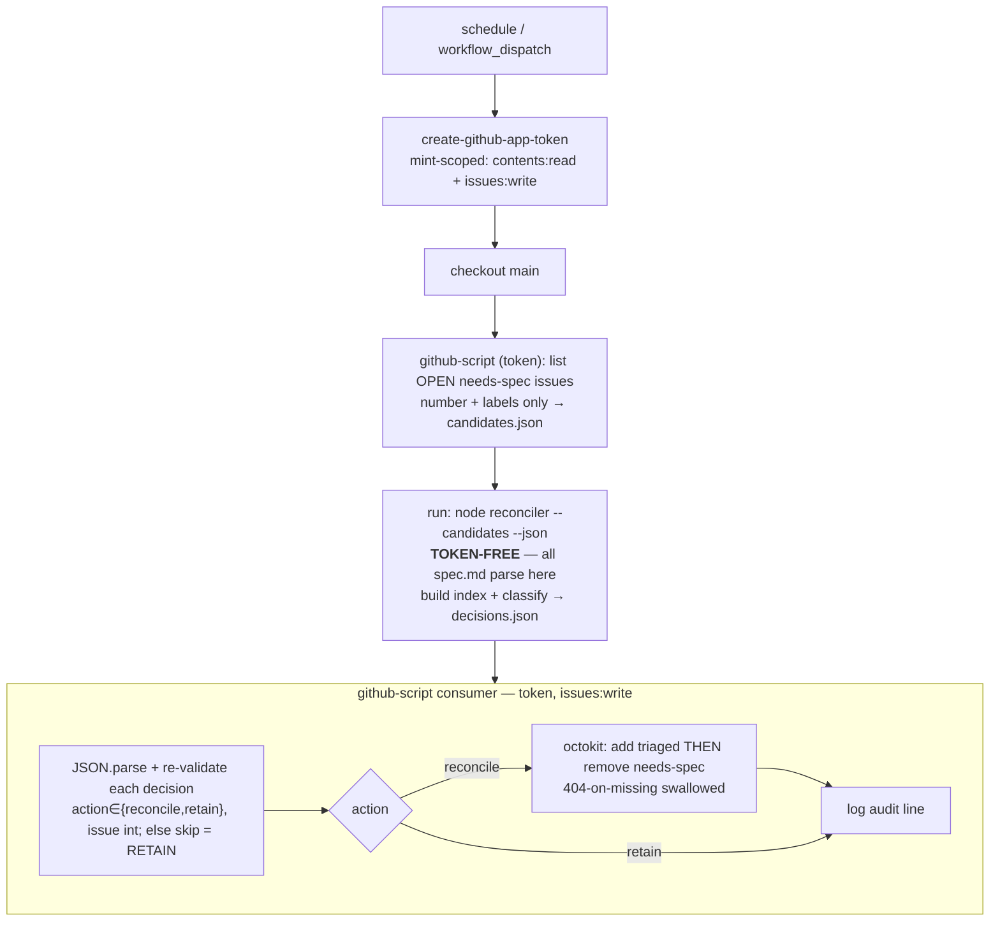

# Design 270-a — `needs-spec` reconciler

Spec 270 asks for one in-tree gate that, for any open `needs-spec` issue already
served by an existing spec, removes `needs-spec` and sets `triaged` in a single
deterministic pass — killing both the P2 duplicate-mint loop and the P3
re-stamp loop. This design places that gate as a **sibling of
`scripts/spec-design-watcher.js`**: a pure-computation Node module fed by an
in-tree source, driven by a scheduled workflow. It is the remove-side only; the
apply-side guard is out of scope (upstream `kata-skills#4`).

## Components

| Component                                    | Responsibility                                                                                                                                                                                                                                                                                                                                                                                                                                          | Model                                                        |
| -------------------------------------------- | ------------------------------------------------------------------------------------------------------------------------------------------------------------------------------------------------------------------------------------------------------------------------------------------------------------------------------------------------------------------------------------------------------------------------------------------------------- | ------------------------------------------------------------ |
| `scripts/needs-spec-reconciler.js`           | Pure classifier + in-tree link index. Given the spec tree and a candidate-issue list, returns one `{issue, link, action, reason}` decision per issue. No network, no label writes.                                                                                                                                                                                                                                                                      | `spec-design-watcher.js` (pure fns + `gitSource`/`fsSource`) |
| Link index                                   | Built from in-tree `spec.md` bodies: `issue# → [specIds]`, populated **only** by an anchored positive-reference match. Bare `#N` mentions do not populate it.                                                                                                                                                                                                                                                                                           | `statusIndex()` map-build                                    |
| `scripts/needs-spec-reconciler.test.js`      | Fixture-driven unit tests over the pure surface — SC 2–6, 9, 10, 12, plus the SC 16 paired open/merged fixture (one synthetic issue #9xx against two `fsSource` trees on one run: `spec.md` ABSENT → RETAIN `reason:"no-link"` [SC 4b], then PRESENT with `Serves issue #9xx` → reconcile). Also: the SC 12 must/must-not-match literal corpus (incl. `Closes #N`-in-code-span), the malformed-`spec.md` fixture (asserts every issue RETAINs, the bad spec id lands in `parseErrors`, and a sibling positive link is unaffected), the SC 6 `already-clear` idempotence fixture, `labelOps`/`auditLine` (SC 15), and the two least-privilege legs `declaredBlockOk` (SC 11 declared-block) + `mintScopeOk` (SC 8 / SC 11 minted-scope), each fixtured independently with a leg-specific over-scoped negative and the spotless-block/over-scoped-mint independence tooth (SC 8). The `fsSource(root)` seam makes every case testable with no git, no token. | `audit-gate.test.js`, `spec-design-watcher.test.js`          |
| `.github/workflows/reconcile-needs-spec.yml` | `schedule` + `workflow_dispatch`; `KATA_KILLSWITCH` first step; `concurrency` group (`cancel-in-progress: false`); default-deny `permissions` + **mint-scoped** App token; every `uses:` SHA-pinned (Dependabot `github-actions`, `.github/dependabot.yml` — SC 13). A **3-step trust-split**: token-scoped `list` → **token-free** `node` compute → thin `github-script` `apply`, one audit line per issue (SC 15). | `monitor-spec-design.yml`                                    |

The workflow is the **only** privileged surface; the Node module is pure and
side-effect-free, so every linkage and retain-vs-mutate decision is unit-tested
off a fixture with no token and no API.

## Data flow

The reconciler's `spec.md` parse (the anchored-link regex) is the highest-risk
code, so it runs in a **token-free `node` subprocess** (no `GITHUB_TOKEN` in its
env), not the privileged `github-script` VM. This fixes the ESM crash the
pre-flight surfaced (repo is `"type":"module"`; `github-script` runs CommonJS, so
`require` → `ERR_REQUIRE_ESM`) and, unlike a single `await import()` step, keeps
the attackable parse off the write-scoped surface (sign-off §3). Evidence is
one-way data: number+labels via `candidates.json`, `spec.md` via the in-tree tree
— never argv or `run:` interpolation; no decision depends on a PR body.

## Interfaces

- **CLI** (the token-free compute step) —
  `node scripts/needs-spec-reconciler.js --candidates=<file> --json [--ref=origin/main] [--root=<dir>]`.
  Reads the candidate list (number+labels) from the `--candidates` JSON **file**
  (never argv), builds the index from `spec.md` on `--ref` (or a `--root` fixture),
  and emits `{decisions, parseErrors}` to stdout (`parseErrors` so `apply` logs the
  diagnostic — never silent). **Token-free: git + fs only, no octokit.** Without
  `--candidates`, `--json` emits the `{index, parseErrors}` object (dry-run). No `--record`.
- **Module exports** (ESM; consumed by the CLI above — the `github-script` consumer
  imports nothing, it executes the emitted JSON):
  - `buildLinkIndex(specSource) → {index: Map<issueNumber, specId[]>, parseErrors: specId[]}` —
    `index` holds ONLY anchored positive links; `parseErrors` lists spec ids whose
    body could not be read/parsed (caught per-`spec.md`; a spec-level diagnostic,
    never an issue reason — see _Fail-safe_).
  - `classify(issue, index) → {issue, link, action: "reconcile"|"retain", reason}` —
    reads `issue.number` (index lookup) and `issue.labels` (`already-clear` gate).
    `reason ∈ {no-link, already-clear}` — both derivable from `(issue, index)`. A
    soft/ambiguous mention carries no positive link, so it resolves to `no-link` →
    RETAIN; "soft mention" is a linkage-grammar class (below), not an issue reason.
  - `parsePositiveLinks(specBody) → issueNumber[]`
  - `labelOps(decision) → {add: string[], remove: string[]}` — pure decision→ops
    map (`{add:["triaged"], remove:["needs-spec"]}` on `reconcile`, else empties);
    emitted into each decision so the consumer names no label from a raw string.
  - `auditLine(decision) → string` — pure one-line audit record (SC 15).
  - `gitSource(ref) / fsSource(root) → specSource` — enumerate `specs/*/spec.md`
    (`git ls-tree`) **and read each body** (`git show ${ref}:specs/<id>/spec.md`,
    caught per-file so a failed read lands in `buildLinkIndex.parseErrors`, never
    aborting the run); the watcher reads paths only, so the body read is new.
    `specSource` is the sole seam: tests drive it off `fsSource`, no git.
- **Workflow → GitHub — 3 steps split at the trust boundary** (see _Data flow_):
  1. **list** (`github-script`, minted token): `state:open,labels:needs-spec`,
     **number+labels only** → `candidates.json` (`labels` flattened from `.name`).
  2. **compute** (`run: node … --candidates=candidates.json --ref=HEAD --json > decisions.json`):
     **token-free**; all `spec.md` parsing + `classify`/`labelOps`/`auditLine`.
     Default checkout depth suffices — `gitSource` reads only the HEAD tree.
  3. **apply** (`github-script` consumer, `issues: write`): `JSON.parse` +
     **re-validate** each decision (`action ∈ {reconcile,retain}`, `issue` positive
     int, `ops` labels ∈ the two known labels; else skip = RETAIN), then for
     `reconcile` octokit `addLabels(["triaged"])` **then** `removeLabel("needs-spec")`
     (404 swallowed) + `console.log` the audit line. Add-before-remove is
     deliberate: a partial-write failure leaves the issue still `needs-spec`
     (RETAIN-equivalent), never bare — the P3 re-stamp trap. Parses no `spec.md`.

## Linkage grammar (the load-bearing decision)

A positive link is an **anchored** reference in a `spec.md` body **in-tree on
`main` — merged, never a PR body** (see _Evidence source_). Bare mentions RETAIN.

| Class            | Pattern (case-insensitive, anchored)                                                       | Action                        |
| ---------------- | ------------------------------------------------------------------------------------------ | ----------------------------- |
| Positive         | `Serves issue #N`, `Serves #N`, `**Issue:** [#N]` (line-leading label form only — bare mid-prose `Issue: #N` is dropped, it false-positives), `Closes/Resolves/Fixes #N` | populates index → `reconcile` |
| Soft / ambiguous | bare `#N`, `likely composing #N`, `may compose #N`, `#N / #M` incidental list              | not indexed → RETAIN          |

The grammar is strict-anchored so a spoofable substring cannot forge a link
(SC 12); `#N`-equals-spec-`N` is never inferred (SC 3). It is precise at the exact
boundary that decides a false drop, and the plan's SC 12 test pins it with a
must/must-not-match literal corpus: `#N` is a **whole-number token** (`#128`
matches; `#1289`/`#1128`/`##128` do not; trailing `.`/`,`/`)`/EOL tolerated);
`**Issue:** [#126](url)` matches through the markdown link and stops at `]`; a
reference in a fenced/inline code span does **not** match. Must-match:
`Serves issue #128.` (spec 140), `**Issue:** [#126](…)` (spec 200). Must-not-match
(fixture-driven): `#27 / #22` incidental list, bare `#128`, `likely composing #130`,
`` `Fixes #9` `` in code, mid-prose `Issue: #128`.

**`Closes/Resolves/Fixes #N` is the widest, most spoofable anchor** (GitHub's
auto-close verb set, a weaker claim than `Serves issue #N`), so it enlarges the
false-DROP surface. **Flagged for the approver** (like the `spec approved`-bypass
Key Decision): kept for coverage, with a dedicated SC 12 code-span spoof case.

## Key Decisions

| Decision                | Choice                                                                                 | Rejected alternative                                                                                                                                                                                                                                                                                                                                                                                                                                                |
| ----------------------- | -------------------------------------------------------------------------------------- | ------------------------------------------------------------------------------------------------------------------------------------------------------------------------------------------------------------------------------------------------------------------------------------------------------------------------------------------------------------------------------------------------------------------------------------------------------------------- |
| Evidence source         | In-tree `spec.md` on `main` only                                                       | Open-PR bodies — attacker-forgeable; anyone opening a PR could plant a reference and force a false drop. A forged link is confidently wrong, so RETAIN never catches it (SC 10).                                                                                                                                                                                                                                                                                    |
| Linkage signal          | Anchored positive-reference phrase                                                     | Issue-number match (`#NN`==spec `NN`) — collides on unrelated numbers (#60 ≠ spec 60), silently dropping spec work (SC 3).                                                                                                                                                                                                                                                                                                                                          |
| Soft mention            | Treat as ambiguous → RETAIN                                                            | Any-substring `#N` match — over-drops on incidental mentions; RETAIN-on-ambiguity is the fail-safe (SC 4).                                                                                                                                                                                                                                                                                                                                                          |
| Compute / effect split  | **Token-free `node` subprocess** computes the decisions; `github-script` consumer only applies them | Single `await import()` step — fixes the ESM crash but loads the parser + its deps into the `issues: write` VM (larger blast radius for identical behaviour); the *minimum* fallback, not the pick (sign-off §3). Third-party label-action — larger supply-chain surface. |
| Effect surface          | First-party `actions/github-script`                                                    | A third-party label-action — larger supply-chain surface; spec forbids handing `GITHUB_TOKEN` to third-party actions.                                                                                                                                                                                                                                                                                                                                               |
| Trigger                 | `schedule` + `workflow_dispatch`                                                       | `pull_request_target` / `workflow_run` — privileged-context traps; and `issues` typed events would self-retrigger on the gate's own label write.                                                                                                                                                                                                                                                                                                                    |
| Manual strip            | Reconciler **replaces** the storyboard-shift strip                                     | Keep both — two writers on one label; the clean break retires the ad-hoc step (SC 7).                                                                                                                                                                                                                                                                                                                                                                               |
| Least privilege         | `contents: read` + `issues: write`, default-deny                                       | `issues: write` alone — under default-deny that sets `contents: none`, breaking `actions/checkout`'s tree read (SC 8). `write-all` — over-broad.                                                                                                                                                                                                                                                                                                                    |
| Token identity          | Kata App token (`actions/create-github-app-token`) **mint-scoped** with `permission-contents: read` + `permission-issues: write` (sign-off §1) | Default `GITHUB_TOKEN` — works for same-repo label writes but diverges from every other issue-mutating workflow here (`monitor-spec-design.yml`, `agent-dispatch.yml`) and attributes triage edits to `github-actions[bot]` instead of the kata bot. Unscoped App token — carries the shared installation's broader permissions; SC 8/11 hold on the token actually used only when scoped at mint (sign-off §1). |
| Reconcile trigger state | In-tree `spec.md` present on `main` (merged artifact)                                  | Gate on STATUS `spec approved` — REJECTED: #275's duplicates arise precisely from specs that merged-but-were-never-approved (off-gate merges are the norm under #196b); requiring approval would leave `needs-spec` re-firing for exactly those specs. Keying on in-tree presence closes the loop the spec exists to close. Surfaced for the approver: this reconciles demand a strict reading of the `needs-spec` convention (clear at `spec approved`) would not. |

## Privileged-surface security sign-off (security-owned; `wiki/design-inputs.md#spec-270`)

1. **Token scope (SC 8/11) — scope AT MINT.** Mint the App token with
   `permission-contents: read` + `permission-issues: write` (both supported at
   pinned `bcd2ba49…` v3.2.0). A minted `create-github-app-token` carries the App
   installation's FULL permissions unless narrowed by `permission-*`; the job
   `permissions:` block bounds only the unused default `GITHUB_TOKEN`. The
   "installation is limited" escape is unavailable — the same Kata App does
   `contents: write` elsewhere. So `permission-*` is the actual bound; keep the
   default-deny job block as defense-in-depth.
2. **SHA pin (SC 13).** `actions/github-script@60a0d83039c74a4aee543508d2ffcb1c3799cdea # v7.0.1`
   — a 40-char commit SHA, never a tag; Dependabot `github-actions` tracks it by
   directory. `create-github-app-token`/`checkout` stay on the model SHAs
   (`bcd2ba49…`, `3d3c42e5…`).
3. **ESM wiring — token-free subprocess (least-privilege).** The `spec.md`/issue
   parse is the highest-risk code; a token-free `node` step keeps it off the
   `issues: write` surface — smaller blast radius than `await import()` (the
   minimum crash-fix fallback). **Trust-boundary rules:** (i) decisions JSON is
   DATA — `JSON.parse` + structural iteration, never `eval`/`run:` interpolation;
   (ii) the consumer re-validates each decision (`action ∈ {reconcile,retain}`,
   `issue` positive int) and skips otherwise (fail-safe RETAIN), never trusting a
   string to name a label; (iii) the candidate list reaches the subprocess as a
   data file, never on the `node` command line (argument injection).

## Fail-safe & idempotence

RETAIN is the default of every path that is not a proven positive link. Each
issue-level retain carries a **named `reason` code and a test** so a future
refactor cannot silently reroute a RETAIN into a drop — and both reasons are
derivable from `(issue, index)` alone, so the classifier needs no signal a
positive-only index cannot carry:

- **`no-link`** — no entry in the positive `index`. The single
  retain-because-unproven code: it covers the absent-spec case (open/draft PR,
  `spec.md` not on `main`, SC 4b/16), a soft/ambiguous mention (SC 4a), and a
  forged/PR-only reference (SC 10). Those tests assert `reason === "no-link"`, not
  just `action === "retain"` — keeping the case out of any "already handled" branch.
- **`already-clear`** — the issue no longer carries `needs-spec` (idempotence,
  SC 6); `classify` reads `issue.labels` to detect it.

**Parse errors are a spec-level diagnostic, not an issue reason** — a
malformed/unreadable `spec.md` lands in `buildLinkIndex.parseErrors` (audit-logged
every run, never silent), attributed to no issue (nothing can be "linked through"
a spec whose parse threw). Safety is structural: a failed parse contributes zero
positive links, so it can only leave issues RETAINed, never drop one. **Named
test:** a malformed body beside a sibling positive link RETAINs every issue, puts
the bad spec id in `parseErrors`, and leaves the sibling link intact.

A false drop loses spec work — strictly worse than a duplicate. Idempotence has
two guards: the `labels:needs-spec` query filter is primary (a reconciled issue
never re-enters the candidate set); the `already-clear` branch is defense-in-depth,
so a query change can't break idempotence without a failing test.

## Boundaries

- **Supersedes:** the manual storyboard-shift `needs-spec` strip — a coach
  convention, not tracked code, so this design renders it redundant (a
  deterministic in-tree gate replaces the ad-hoc human step) rather than deleting
  it; the coach retires the convention once the gate is live. Two writers on one
  label collapse to one, no shim (SC 7).
- **Does not touch:** STATUS rows, `spec approved` (human-only), the apply-side
  guard (upstream `kata-skills#4`), or the `triaged` label definition (already
  provisioned this session).
- **No abandoned-draft restore leg — prevented at source.** Because evidence is
  merged `spec.md` on `main`, a draft-linked issue (e.g. #103/#127/#130, specs
  110/130/150 on open PRs #122/#144/#171) gets no positive link → RETAIN →
  `needs-spec` **persists** until its spec merges (the open PR is the visible
  guard against a P2 duplicate-mint). Merged-only never clears a draft, so there
  is nothing to restore (coach ruling, confirms Key Decision #1). This is SC 16's
  fixture-backed hinge; #130 (open PR #171 for spec 150) is its live instance.
- **#129 coverage** needs a plan precondition — a `Serves issue #129.` seed in
  already-merged spec 210 or 60 (in-tree → trusted-evidence). Until then #129
  correctly RETAINs; the plan carries the seed, the design does not (SC 9).

— Staff Engineer 🛠️
