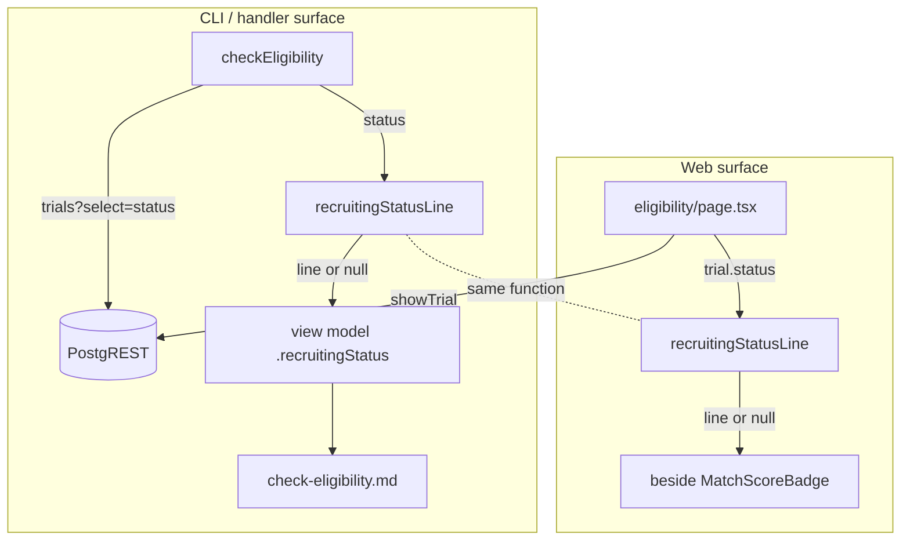

# Design 280-a: Screener result carries the trial's recruiting status

Spec: [spec.md](spec.md). This design says WHICH components change and WHERE the
recruiting status enters each screener surface. Additive by the spec's
compatibility stance — nothing is removed; the fit result stays and the
recruiting context rides alongside it (X2).

## Problem restated

The screener reports a fit outcome from the criteria answers alone and never
states whether the trial is accepting participants. Two surfaces render a
result — the CLI/handler path (`check-eligibility`) and the web screener page —
and neither uses the trial's `status`. The handler never reads the `trials` row
at all (it round-trips only to `criteria`/`conditions`); the web page fetches
the trial (via `showTrial`) but ignores `status` in the result render. Closing #298 means both surfaces surface the recruiting status
beside the fit outcome, in plain language, without rescoring (X1) or hiding the
outcome (X2).

## Central decision: one resolver, not two mappings

The open/not-open decision and its plain-language text live in **one pure
function** exported from the handlers package and imported by both surfaces:

```
recruitingStatusLine(status: string | null | undefined): string | null
```

- Returns `null` **only** when `status === 'recruiting'` — the single open state
  renders as today, no status text (S3, C3).
- Returns distinct, patient-readable text for each of the three named
  non-recruiting states (S2, C2).
- Returns a **generic not-open line** for every other value — unknown, unlisted,
  or absent (the fail-safe default).

The rule is structurally **recruiting-vs-not**: `recruiting` is allowlisted as
open; everything else is treated as not-confirmed-open. This is the facilitator
WHAT-gate resolution (approach a) of the S1-vs-S3 tension. S1 states the general
guarantee — a non-recruiting result is never shown without saying the trial is
not open — and this resolver honors S1 for *every* non-`recruiting` value, not
just the three named today. It is **not** a closed enumeration: adding a future
`suspended`/`terminated` value needs no code change; it falls to the generic
line automatically, closing the fail-open path #298 first opened.

A shared resolver is the load-bearing choice because the CLI template is
logic-free mustache: the handler must pre-compute the line for it, while the web
page computes its own from the `status` it already holds. Two call sites, one
rule — so the fail-safe cannot drift on one surface.

## Components

| Component | File (WHERE) | Change |
| --- | --- | --- |
| Recruiting-status resolver | `products/polaris/handlers/src/recruiting-status.js` (new) | The pure `recruitingStatusLine` function above; the sole home of the fail-safe rule. A named export from the package index (`@bionova/polaris-handlers`), consumed by the site via the existing `allowJs` named-import convention that `showTrial`/`checkEligibility` already use — its `@param`/`@returns` JSDoc gives the site its types, so no new `.d.ts` is added. |
| Eligibility handler | `products/polaris/handlers/src/check-eligibility.js` | After the fit result is built, read the trial's `status` (net-new `trials?id=eq.{id}&select=status` round-trip, reusing the module's established `eq` / `rows[0] ?? …` read idiom) and attach `recruitingStatus = recruitingStatusLine(status)` to the returned view model. |
| CLI template | `products/polaris/handlers/templates/check-eligibility.md` | Render a new recruiting-status section, guarded on the scalar's truthiness (`{{#recruitingStatus}}`, not a `.length` guard); absent for a recruiting trial (`null` → section omitted). |
| Web screener page | `products/polaris/site/src/app/trials/[id]/eligibility/page.tsx` | Carry `status` on the page's `showTrial` return type (the field is already selected server-side — no new read); when a `score` is present, render `recruitingStatusLine(trial.status)` beside the unchanged `MatchScoreBadge`. The `status` shape comes from the handler's return, not a divergent inline type. |

Untouched: `eligibility-check/` edge function (C4), `eligibility-view.js`
scorer-reason parsing, `MatchScoreBadge` (C6), the recorded interest signal
(X6), and `showTrial`'s existing `status` selection (reused as-is).

## Data flow



Both surfaces read the same source of record — the `trial.status` field rendered
from `story.dsl` — and pass it through the same resolver. The handler pays one
extra round-trip because it does not otherwise read the `trial` row; the web
page pays none because `showTrial` already selects `status`.

## Key decisions

| Decision | Choice | Rejected alternative |
| --- | --- | --- |
| Where the fail-safe rule lives | One shared `recruitingStatusLine` in the handlers package, imported by handler + web | Inline the status→text map in each surface — two copies of the rule drift, re-arming the fail-open trap the WHAT-gate forbids |
| Resolver's module home | New `recruiting-status.js` | Add it to `eligibility-view.js` — that module parses the scorer's reason grammar with a fail-loud throw; the recruiting rule is orthogonal to scoring and must be importable by the web page without pulling the reason-parsing machinery into a server component |
| Open/not-open pivot | Allowlist `status === 'recruiting'`; everything else → a not-open line | Closed enum of the three named states with "any other value → no text" (spec S3 literal) — silently reintroduces #298 for the next unlisted value |
| Unlisted/absent status | Generic not-open line (fail-safe; exact string plan-owned) | Extend the named list (`suspended`/`terminated`, …) — a longer whitelist re-arms the identical trap for the next value |
| Handler reads `status` | Net-new `trials?…&select=status` read in the handler | Thread `status` out of the `eligibility-check` edge function — would modify the scorer (X1/C4) |
| Web result text source | Compute from the `trial.status` the page already fetches | Pass `status` through the submit-route redirect/score param — couples status to the score, and the score round-trips through the URL |
| Text is value-only | Line is a pure function of `status`; no trial id/name input | Per-trial status prose — violates the no-hand-authored-domain-content invariant (X5, C7) |

## Fail-safe rule and S3 note

S3's literal wording ("recruiting — or any value other than the three
non-recruiting states — … adding no status text") reads, for a *future*
non-recruiting value, as silence — the fail-open path the facilitator gated.
This design narrows the no-text branch to `status === 'recruiting'` alone, per
approach (a). Today this is behaviorally identical to S3: the seed's `status`
takes exactly four values (`recruiting` + the three named), so no unlisted value
exists to diverge on. The divergence is deliberate and only future-facing.

**Reconcile in the spec, not this footnote (required before merge).** Because
spec 280 is still draft on PR #304, the clean resolution is to tighten S3's
"recruiting — or any value other than the three non-recruiting states" to
"recruiting" alone, so the spec text and shipped behavior agree. This design
does not edit the spec (staff does not author specs); it flags the S3 edit as a
pre-merge condition for whoever holds PR #304. Until that edit lands the design
faithfully implements S1's general guarantee; if the approver instead wants S3's
literal closed-enum, the spec returns to draft and this design is revised — the
design never widens silently.

## Success-criteria coverage

| Criterion | Where met |
| --- | --- |
| C1 (non-recruiting result shows not-open text beside the outcome) | Handler attaches `recruitingStatus`; template renders it |
| C2 (each named state names its own state; three phrasings differ) | Resolver's three named branches |
| C3 (recruiting renders as today, no text) | Resolver returns `null` for `recruiting`; template omits the section |
| C4 (scorer untouched; score/reasons unchanged) | No change under `eligibility-check/`; handler only adds a read + field |
| C5 (no raw underscored identifiers surface) | Resolver emits prose only, never the enum token |
| C6 (web badge unchanged; text beside it) | `MatchScoreBadge` untouched; new sibling element |
| C7 (text determined by `status` value alone) | Resolver signature takes only `status` |

## Out of scope (design boundary)

The invalid-age early return in `checkEligibility` produces no fit outcome, so it
carries no recruiting-status line — the status rides with a *result*, and there
is no result to ride (consistent with X2). Distinguishing the three non-recruiting
states on the shareable-summary surface (spec 60's binary framing) is unchanged;
this design touches the screener surface only.

— Staff Engineer 🛠️
