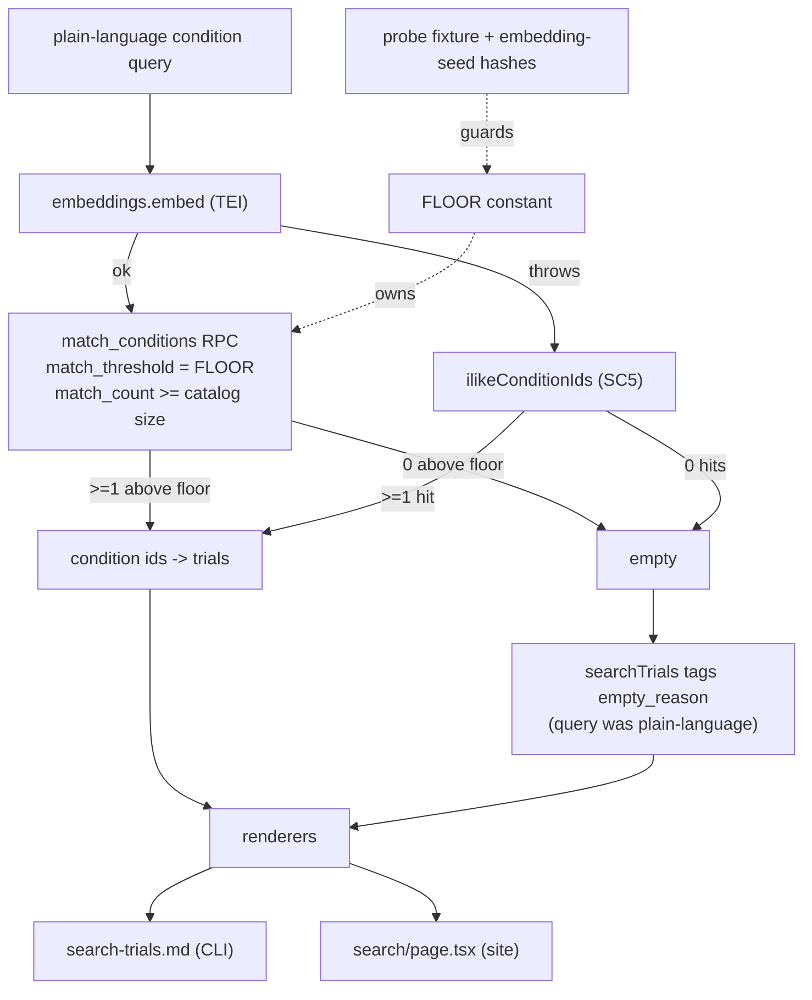

# Design 290: An effective, measured relevance floor for plain-language search

Spec 290 fixes one broken path: the `isPlainLanguage` branch of `searchTrials`
resolves a condition query through the `match_conditions` RPC, whose `0.3` floor
is guessed and sits below the seed embeddings' separation point — so nonsense
(`banana`) clears it and the query returns the catalog. The fix makes the
_existing_ floor effective (a measured value), turns an unresolved plain-language
query into a confident empty with an explicit affordance, and backs the value
with a verification artifact that runs stackless yet fails when the seed drifts.

## What changes, at a glance

## Components

| #   | Component                               | Where                                                                                                    | Role                                                                                                                                                                                                                                                                                                                                                                          |
| --- | --------------------------------------- | -------------------------------------------------------------------------------------------------------- | ----------------------------------------------------------------------------------------------------------------------------------------------------------------------------------------------------------------------------------------------------------------------------------------------------------------------------------------------------------------------------- |
| C1  | `searchTrials` / `semanticConditionIds` | `products/polaris/handlers/src/search-trials.js`                                                         | Passes `FLOOR` to the RPC; drops the success-path ILIKE rescue; `searchTrials` tags the empty when the query was plain-language.                                                                                                                                                                                                                                              |
| C2  | `FLOOR` constant                        | same module (named export)                                                                               | The single measured floor value, imported by the guard test.                                                                                                                                                                                                                                                                                                                  |
| C3  | `match_conditions`                      | `products/polaris/site/supabase/migrations/20260601000004_match_function.sql`                            | Unchanged body and signature; the caller supplies an explicit `match_threshold`. The stale `0.3`-justifying comment is corrected.                                                                                                                                                                                                                                             |
| C4  | probe-similarity fixture                | `products/polaris/handlers/test/fixtures/relevance-probes.json`                                          | Scalar cosine scores per (probe × condition), plus the provenance they were measured against: the two **embedding-governing** `SEED.sha256` lines (`seed_015_condition_embeddings.sql` + `seed_embeddings.jsonl` — not the whole 16-file manifest).                                                                                                                           |
| C5  | floor-guard test                        | `products/polaris/handlers/test/relevance-floor.test.js`                                                 | Stackless: asserts every positive ≥ `FLOOR`, every negative < `FLOOR` over C4, **and** that C4's recorded seed hashes still equal the values **read back live from the committed `data/synthetic/SEED.sha256`** (never a re-copied literal), so a seed re-render fires the guard rather than passing tautologically.                                                          |
| C6  | fixture regeneration recipe             | `scripts/measure-relevance-floor.js` + a `just measure-floor` recipe                                     | Stack-gated: embeds each probe (live TEI), reads similarities via C3, writes C4 with the current seed hashes. Re-run when either embedding-governing seed line changes.                                                                                                                                                                                                       |
| C7  | empty-state affordance                  | `products/polaris/handlers/templates/search-trials.md` + `products/polaris/site/src/app/search/page.tsx` | When `empty_reason` is set, render an explicit "no confident match" notice + next step **in place of** the bare count line (template `{{total}} trial(s) found.` / site `{result.total} trial{s} found`) and the template's `No trials matched.`; the field's site type home is the inline `searchTrials` result cast in `page.tsx`, widened for the optional `empty_reason`. |

## Key Decisions

| #   | Decision                                                                                                                                                                                                                                                                                                                                                                                                                                                                                          | Rejected alternative & why                                                                                                                                                                                                                                                                                                                                                                                                                                                                                                                                                                                                                                                          |
| --- | ------------------------------------------------------------------------------------------------------------------------------------------------------------------------------------------------------------------------------------------------------------------------------------------------------------------------------------------------------------------------------------------------------------------------------------------------------------------------------------------------- | ----------------------------------------------------------------------------------------------------------------------------------------------------------------------------------------------------------------------------------------------------------------------------------------------------------------------------------------------------------------------------------------------------------------------------------------------------------------------------------------------------------------------------------------------------------------------------------------------------------------------------------------------------------------------------------- |
| D1  | **The floor lives as one `FLOOR` constant in the handler, passed to the RPC's existing `match_threshold` arg;** the migration's now-inaccurate `0.3` comment is corrected so the SQL stops re-seeding the guess.                                                                                                                                                                                                                                                                                  | Bump the SQL `DEFAULT 0.3` in the migration — buries a discovery-critical value away from the handler and test that must agree with it, and re-guesses it in SQL. Also rejected: a second floor filtering the RPC's returned `similarity` in the handler — two values to keep in sync.                                                                                                                                                                                                                                                                                                                                                                                              |
| D2  | **Verify against a checked-in probe fixture (C4) asserted stackless (C5); a stack-gated recipe (C6) regenerates it, and C4 carries the two embedding-governing seed hashes it was measured against — so C5 goes red the moment the condition embeddings are re-rendered.** Scoping to those two seed lines (not the full manifest) keeps the guard from crying wolf on unrelated seed churn (stories, FAQs). The tie makes the stackless guard self-invalidating, not a snapshot that rots green. | A stack-gated integration test as the sole verification — real embeddings need the stack (TEI + `condition_embeddings`, built at setup), so it cannot run under the stackless `just test` tier SC4 names. Also rejected: a fixture with no seed-hash tie — it silently drifts from the embeddings it claims to measure. Also rejected: tying to the whole `SEED.sha256` manifest — over-fires on seed changes that never touch the embeddings. Also rejected: pinning the runtime model id inside this test — the render-model/runtime-model match is a system-wide invariant (see Residual), not the floor guard's job, and lives in no single checked-in home worth parsing here. |
| D3  | **Any empty from the plain-language path is tagged `empty_reason: "no_confident_match"`.** `searchTrials` already computes `isPlainLanguage(condition)`, so it tags the empty at the shared early return with no change to `semanticConditionIds`'s return type. This covers the below-floor empty and the SC5 embed-failure empty alike. The success-path ILIKE rescue is removed; the embed-failure fallback survives (SC5).                                                                    | Tag only the below-floor empty — leaves the SC5 embed-failure empty (`banana` with the service down) rendering as a bare zero, which SC7 forbids. Also rejected: signal the empty via `total === 0` alone — renderers cannot separate a plain-language no-match from a catalog-id query with no linked trials.                                                                                                                                                                                                                                                                                                                                                                      |
| D4  | **`match_count` is raised to at least the embedded-condition count** (one embedding row per condition, enforced by the `condition_embeddings` unique index) so the floor alone governs inclusion.                                                                                                                                                                                                                                                                                                 | Leave `match_count = 5` — with six seeded conditions a top-k cut could silently drop a genuine above-floor match, reintroducing a non-relevance cut the spec rejects.                                                                                                                                                                                                                                                                                                                                                                                                                                                                                                               |

**Compatibility note.** `empty_reason` is an additive optional field; existing
consumers ignore an unknown key, so the spec's "no interface break" holds. SC7
_requires_ this discriminator — the field is spec-mandated, not a silent shape
expansion.

## Choosing the FLOOR value

The value is **measured, not set here.** C6 runs against the live seed and writes
C4; the value is then fixed to sit inside the empirical gap between the highest
negative similarity and the lowest positive similarity, **biased toward recall**
(just above the top negative). Rejected: the gap midpoint — the placeholder
deliberately invites near-miss queries, so protecting recall on paraphrases
outweighs a symmetric margin. If no gap exists — a negative outscoring a
positive — C5 fails loudly; that failure is the honest signal that the seed's
embeddings do not separate and the spec's premise, not the code, must be
revisited.

**Division of verification labor.** C5 guards only that the floor separates the
probe scalars. That the wired `FLOOR`/`match_count` produce the SC1–SC3 trial
outcomes is bound by the SC1/SC2/SC3 handler tests (stubbed RPC), not by C5.

**Residual the tripwire does not guard.** C5 pins only the embeddings the floor
was measured against (the two `SEED.sha256` lines). It does **not** pin the TEI
model. That is deliberate: the runtime query model must match the model that
rendered the stored `condition_embeddings`, or cosine similarity compares vectors
from two spaces and **all** semantic search breaks — not just the floor. That
render-model/runtime-model match is a pre-existing system-wide invariant, held by
deployment config (`docker-compose.yml`'s TEI `--model-id`, overridable by
`.env`), and a mismatch is invisible to any stackless test — the same stack
boundary SC4's tier draws. Guarding it inside the floor test would parse a value
that lives in no single checked-in home and would still miss a runtime override;
so it stays where it belongs, an operator invariant, not the floor guard's.

## Probe set (labels; values measured by C6)

Drawn from spec Decision 3; the concrete list has one home, the C4 fixture.

- **Positives (≥ FLOOR):** `type 2 diabetes` and `high blood sugar` → the
  `diabetes-t2` condition; at least one free-form paraphrase that is **not** a
  stored synonym (exercises the embedding path, not ILIKE); one paraphrase per
  other seeded condition.
- **Negatives (< FLOOR):** `banana`; a query naming a different seeded disease
  that must not surface an unrelated condition — e.g. a diabetes query must
  leave the breast-cancer and COPD conditions below the floor, so their trials
  (`her2-combo`, `copd-inhaler`) never enter the result.

## Data flow — a plain-language empty

1. `searchTrials` sees a plain-language `condition`; calls `semanticConditionIds`.
2. On embed success the RPC is called with both `match_threshold = FLOOR` and
   `match_count ≥ catalog size` — args newly added to a call site that today
   passes only `query_embedding`; zero conditions clear the floor → `[]`. (On
   embed failure the path degrades to ILIKE, SC5; a nonsense token still → `[]`.)
3. `searchTrials` sees `conditionIds.length === 0` with
   `isPlainLanguage(condition)` true, and returns
   `{ trials: [], total: 0, query, empty_reason: "no_confident_match" }`. The
   later `trialIds.length === 0` empty (a resolved condition with no linked
   trial) stays untagged — it is a confident match with zero trials, which SC7
   does not govern.
4. Each renderer (C7) sees `empty_reason` and shows the explicit "no confident
   match" notice with a next step — never a bare `0 trials found`, never a hedged
   match. On the CLI this supersedes the template's bare `No trials matched.` for
   the tagged case.

## Interfaces

- **Added (additive):** optional `empty_reason` on the `searchTrials` result, set
  on any plain-language empty (widening the site's inline result cast in
  `page.tsx`). `FLOOR` named export. C4 fixture (with embedding-seed
  provenance), C5 test, C6 recipe.
- **Removed (clean break):** the `if (ids.length === 0) return
ilikeConditionIds(db, condition)` rescue on `semanticConditionIds`'s
  embed-success path. The embed-failure fallback and the catalog-id / raw-ILIKE
  paths are untouched.
- **Unchanged:** the `match_conditions` SQL body and signature; the
  `searchTrials` _trial_-result shape; the keyword fallback's trigger (SC5); the
  eligibility screener (SC6 — this design touches no screener component).

## Success criteria → components

SC1/SC2/SC3 → D1+D4 (nonsense falls below the floor → empty; near-miss and direct
queries clear it → a shortlist excluding unrelated-disease trials). SC4 →
C4+C5+C6 (measured value, stackless guard, seed-hash tripwire). SC5 →
embed-failure ILIKE path unchanged; its empty is tagged by D3. SC6 → no screener
component in scope. SC7 → D3 tag + C7 renderers on both surfaces.

— Staff Engineer 🛠️
