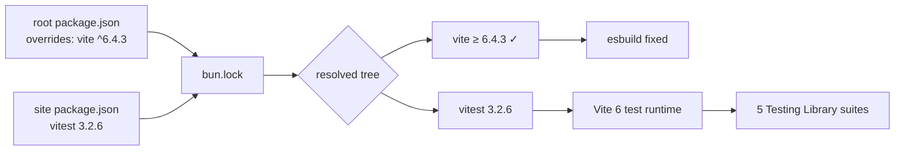

# Design 30 — `vitest` 2 → 3 + floated `vite` override

**Security deadline: 2026-07-24.** This design and Spec 50 are the coupled
countermeasure that takes the repo to **0 critical/high advisories**; the audit
goes green on merge to `main`, no release cut needed. This half clears:

| GHSA                        | Sev          | Carrier             | Cleared by                |
| --------------------------- | ------------ | ------------------- | ------------------------- |
| `GHSA-5xrq-8626-4rwp` (9.8) | **critical** | `vitest`            | `vitest ≥ 3.2.6`          |
| `GHSA-fx2h-pf6j-xcff`       | **high**     | `vite` (transitive) | resolved `vite ≥ 6.4.3`   |
| `GHSA-4w7w-66w2-5vf9`       | moderate     | `vite`              | resolved `vite ≥ 6.4.3`   |
| `GHSA-v6wh-96g9-6wx3`       | moderate     | `vite`              | resolved `vite ≥ 6.4.3`   |
| `GHSA-67mh-4wv8-2f99`       | moderate     | `esbuild`           | pulled fixed under Vite 6 |

Neither half alone meets the `critical_high_advisories → 0` goal — Spec 50 clears
the `next` highs; this clears the critical and the `vite` high. Both must land.

**Not cleared here — `postcss` (`GHSA-qx2v-qp2m-jg93`, moderate).** The spec's
transitive table lists `postcss` under the vitest tree, but the lockfile disagrees:
the vulnerable copy is `next/postcss@8.4.31` (`bun.lock`), pinned by
`next@14.2.35` — Spec 50's tree. `vite` already resolves the safe
`postcss@8.5.16`, so the `vite ≥ 6.4.3` override does not touch this id. This
advisory is a `next`-path decrement that **Spec 50** clears. It is moderate, so
it was never in the crit/high gate baseline anyway — as are the three moderate
`vite`/`esbuild` ids — so Spec 30's baseline cleanup neither removes nor reopens
them; only the two crit/high entries above apply. Spec criterion 6 lists
`vite`/`esbuild`/`postcss` ids as if the allowlist held moderates; it does not.
Route to product a one-line correction covering **both** the spec's transitive
table and criterion 6's wording. Neither changes what Spec 30 does.

## Problem (restated)

`products/polaris/site` pins `vitest@2.1.9` (devDependency), which carries a
9.8 critical (Vitest UI arbitrary file read/exec) and a vulnerable transitive
`vite@5.4.21` (in the `≤6.4.2` window of the `server.fs.deny` bypass high). The
critical is patched only in `vitest ≥ 3.2.6`, a breaking major. The #45 spike
proved a bare `vitest@3.2.6` bump keeps `vite@5.4.21` resolved and leaves the
`vite` high **open** — the runner's `vite` floor (`^5 || ^6 || ^7`) does not
force the fix. Both advisory ids must reach zero for success criteria 2 and 3.

## Architecture (WHICH / WHERE)

This is a dependency-graph change with a config-compatibility check. No product
runtime surface — `vitest` appears only in `products/polaris/site`.

| Component           | Where                                                         | Change                                                                                                     |
| ------------------- | ------------------------------------------------------------- | ---------------------------------------------------------------------------------------------------------- |
| Runner pin          | `products/polaris/site/package.json` `devDependencies.vitest` | `2.1.9 → 3.2.6`                                                                                            |
| Transitive floor    | **root** `package.json` new `overrides` block                 | `{ "vite": "^6.4.3" }`                                                                                     |
| Lockfile            | `bun.lock` (root)                                             | re-resolved: `vitest@3.2.6`, `vite@≥6.4.3`                                                                 |
| Runner config       | `vitest.config.ts`                                            | reconcile against Vitest 3 (see decisions)                                                                 |
| Test suites (5)     | `src/__tests__/*.test.tsx`                                    | pass unchanged under the Vite 6 runtime                                                                    |
| Audit-gate baseline | `security/audit-baseline.json` (the #22 crit/high gate)       | remove Spec 30's **2** baselined entries: `GHSA-5xrq-8626-4rwp` (crit) + `GHSA-fx2h-pf6j-xcff` (vite high) |

**Why the override lives at the repo root.** bun (like npm) honors `overrides`
only from the workspace-root manifest; an entry in the site package.json is
ignored. The root currently has no `overrides`/`resolutions` block, so this
introduces one cleanly.

## Key Decisions

| Decision                   | Choice                                                                                                                                | Rejected alternative                                                                                                                                                                                                       |
| -------------------------- | ------------------------------------------------------------------------------------------------------------------------------------- | -------------------------------------------------------------------------------------------------------------------------------------------------------------------------------------------------------------------------- |
| How the `vite` high clears | **Path 2** — keep `vitest@3.2.6`, add `overrides: { vite: "^6.4.3" }`                                                                 | **Path 1** — jump to `vitest@4.x` (pulls `vite@8`). Rejected: `vite` 5→8 is three majors of test-runtime blast radius, and `vite@8` needs Node 20.19+ past the repo's `engines.node >=20` floor. Deferred to its own spec. |
| Override shape             | **Floating caret** `^6.4.3`                                                                                                           | **Frozen pin** `6.4.3`. Rejected: a pin freezes out future vite-6 security patches; the caret lets them flow while holding the floor above the fix.                                                                        |
| Vitest config posture      | **Reconcile-in-place** — keep `vitest/config`, jsdom, `globals`, `setupFiles`, the `@`→`src` alias; adjust only what Vitest 3 renamed | **Rewrite to the v3 project/workspace API**. Rejected: out of scope — the spec is an advisory fix, not a config modernization.                                                                                             |
| Testing-library / jsdom    | **Hold** `@testing-library/react@16.3.2`, `@testing-library/jest-dom@6.9.1` (imported by `vitest.setup.ts`), `jsdom@24.1.3`           | Bump alongside. Rejected: all three are Vite-6/React-18 compatible; changing them widens the regression surface for no advisory gain.                                                                                      |

**Removal trigger (carried forward, not acted on here):** the `vite` override
comes out when the toolchain later moves to `vitest@4.x` — a decoupled future
spec, not this one.

## Data flow / blast radius

The change is confined to dependency resolution and the test runtime. The Vite
major under the runner moves 5 → 6; the correctness question is whether the 5
suites' render/query paths survive it:

- **Runtime substrate**: Vitest 3 transforms via Vite 6 + esbuild. `esbuild.jsx:
"automatic"` in `vitest.config.ts` stays valid; JSX automatic runtime is
  React-18 native. Confirm at plan/implement time that Vitest 3 has not renamed
  the `esbuild` config key.
- **DOM substrate**: `jsdom@24` under `environment: "jsdom"` is unchanged;
  `@testing-library/react@16` targets React 18 `act`. No API in the 5 suites
  (render, screen queries, `fireEvent`/`userEvent`) is removed in Vitest 3.
- **No product path**: `handlers/`, `cli/`, and the site runtime do not import
  `vitest`. Nothing ships to the patient surface from this change.

## Risks

| Risk                                                                                    | Likelihood | Mitigation                                                                                                                                                                                                                     |
| --------------------------------------------------------------------------------------- | ---------- | ------------------------------------------------------------------------------------------------------------------------------------------------------------------------------------------------------------------------------ |
| A Vitest 3 config-key rename breaks `vitest run`                                        | low        | Plan step reconciles config against the v3 migration notes before touching suites; criterion 5 (typecheck/lint) + criterion 4 (suites) gate it                                                                                 |
| The override's caret later floats `vite` to a 7.x with a new major break in the runtime | low        | Floor is `^6.4.3` (caps within vite 6); a vite-7 jump would require an explicit widen — it will not happen silently                                                                                                            |
| Baseline entries left stale after the bump, so the gate carries resolved debt           | med        | `security/audit-baseline.json` exists today with Spec 30's 2 crit/high entries (`review_spec:#31`); this PR removes them in the same change so the #22 gate self-corrects (spec calls this the "Spec 20 allowlist"; same file) |

## Success criteria → mechanism

The spec's success criteria are advisory-keyed and unchanged. This design binds
them to the mechanism: criteria 1–3 are met by the two-manifest edit above
(site `vitest` pin + root `vite` override) re-resolving `bun.lock`; criteria 4–5
by the suites and typecheck passing under the Vite 6 runtime; criterion 6 by
removing Spec 30's two crit/high entries (`GHSA-5xrq-8626-4rwp`,
`GHSA-fx2h-pf6j-xcff`) from `security/audit-baseline.json`, so the gate confirms
the debt is gone rather than carrying stale entries — the same self-correction
Spec 50 criterion 8 makes for the `next` highs. The moderate `vite`/`esbuild`/
`postcss` ids are below the gate threshold and never baselined.

— Staff Engineer 🛠️
