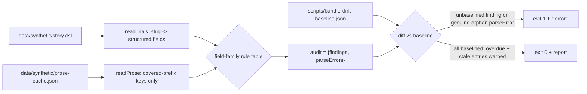

# Design A — Spec 300: Prose-vs-structured-field drift detector

Detects generated `prose-cache.json` assertions that contradict the `story.dsl`
structured field they derive from, over the vendored `data/synthetic/` bundle,
and routes each finding upstream to `fit-terrain`. Detect-and-route only — the
gate never edits the vendored bundle.

## Restatement

- **Problem.** `story.dsl` (structured truth) and `prose-cache.json` (generated
  patient prose) are reconciled by nothing. A contradiction baked into the
  bundle — DIABPREV-201's FAQ says "looking for about 300 people" while its
  `status` is `active_not_recruiting` at 298/300 — reaches the patient verbatim.
- **Scope.** One in-tree DETECT+ROUTE gate over `data/synthetic/`, rule stated
  once and parameterized by structured field: a generated assertion must not
  contradict the field it derives from; on contradiction, flag and route
  upstream, never edit the bundle.
- **Success (SC1–SC6).** Reports both DIABPREV-201 variants (SC1); clean on
  CARDIO-301 (SC2); never mutates the bundle (SC3); emits a durable routed
  record naming trial + prose key (incl. `#hash`) + conflicting field (SC4); the
  criteria family reuses the same rule as data, not a second detector (SC5);
  runs in the `check-seed` CI job so future drift fails before merge (SC6).

## Architecture

A single read-only Node gate, `scripts/bundle-consistency-gate.js`, modeled on
the existing `scripts/audit-gate.js` baseline gate: read the two vendored
operands, select only the prose keys a family covers, join to trials, apply a
field-family rule table, diff findings against a committed routed-findings
baseline, fail CI only on findings _not_ baselined.

## Components

| Component                       | Responsibility                                                                                                                                                                                                                                                                                                                                                                                                                                                                                                                                                                                                                                                                               | Interface                                                        |
| ------------------------------- | -------------------------------------------------------------------------------------------------------------------------------------------------------------------------------------------------------------------------------------------------------------------------------------------------------------------------------------------------------------------------------------------------------------------------------------------------------------------------------------------------------------------------------------------------------------------------------------------------------------------------------------------------------------------------------------------- | ---------------------------------------------------------------- |
| `readTrials(storySrc)`          | Scoped block reader over `story.dsl`: per `trial <slug> { … }`, extract declared structured fields (`status`, nested `criteria`). Not a general DSL parser — reads exactly the fields the rules need.                                                                                                                                                                                                                                                                                                                                                                                                                                                                                        | `→ { trials: {slug: {status, criteria, …}}, parseErrors: [] }`   |
| `readProse(cacheSrc, families)` | Parse the JSON; keep **only** keys whose prefix a family covers (the charter covers `clinical_trial_faq_`). All other kinds — condition explainers, consent, patient stories, site/therapy, and the cache's non-clinical keys — are out of scope and never read. For a covered key `clinical_trial_faq_<slug>#<hash>`, `<slug>` is the substring between the fixed prefix and `#`; the raw key string is its identity.                                                                                                                                                                                                                                                                       | `→ { entries: [{proseKey, slug, kind, text}], parseErrors: [] }` |
| Field-family rule table         | Data, not code paths. Each family declares its `keyPrefix`, the structured `field` it reads, and `contradicts(text, value) → null \| {reason, excerpt}`. Adding a family adds a row, never a pipeline.                                                                                                                                                                                                                                                                                                                                                                                                                                                                                       | `FAMILIES: Family[]`                                             |
| `runAudit(trials, prose)`       | Resolve each covered entry's slug to a trial — exact match, else separator-normalized (`_`≡`-`) so a spelling-alias of a real trial (`diabetes_prevention` → `diabetes-prevention`) is checked as that trial's prose (its own raw key; nothing collapsed or dropped). Run every matching family; collect findings. Each of the 6 real trials carries 3 covered FAQ keys (18 resolved total); a trial's alias variant is checked like any other and passes unless its own text contradicts. A slug that resolves to no trial under either spelling (a **genuine orphan**: `diabex_p2`, `lungshield_p1`, `neuregen_p2`, `oncora_p3`) is a `parseError` — surfaced, never silently dropped.     | `→ {findings, parseErrors}`                                      |
| `diffLedger(audit, baseline)`   | Set-diff **both** findings and genuine-orphan parseErrors against the baseline by key. Partition into `unbaselined` (a finding or orphan not in the baseline — fail), `overdue` (baselined, `review_by` past — warn), and `stale` (a baselined finding **or accepted orphan** with no current match, e.g. an upstream-dropped orphan key — warn, flag for removal). So the accepted set neither masks a new orphan nor accretes dead entries.                                                                                                                                                                                                                                                | `→ {unbaselined, overdue, stale}`                                |
| Routed-findings baseline        | Committed `scripts/bundle-drift-baseline.json` — the durable SC4 record, outside the vendored `data/synthetic/` tree (human-owned, never vendored). Each entry names trial, raw prose key (incl. `#hash`), field, `structuredValue`, and the upstream route (`fit-terrain` ref + optional `review_by`/`review_spec`). Ships baselined: the two DIABPREV-201 findings (routed) and the four genuine-orphan FAQ keys (`diabex_p2`, `lungshield_p1`, `neuregen_p2`, `oncora_p3`; accepted). A new orphan absent from the baseline fails CI, so the accepted set cannot mask future drift. The committed JSON is the canonical orphan/finding set — slugs named in this design are illustrative. | JSON, human-edited only                                          |
| CI step                         | New step in `check-seed.yml` running the gate; plus `bundle-consistency-gate.test.js` under `bun test scripts`.                                                                                                                                                                                                                                                                                                                                                                                                                                                                                                                                                                              | —                                                                |

## Interfaces

- **Finding.** `{trial, proseKey, field, structuredValue, reason, excerpt}`. The
  baseline-diff key is the raw `proseKey + ":" + field + ":" + structuredValue`.
  The raw `proseKey` (full string incl. spelling and `#hash`) is the identity —
  the gate does **not** assume `#hash` is a content hash (the same `#hash` recurs
  under different spellings with different text). A new prose variant is a new raw
  key; an upstream `structuredValue` change (e.g. `active_not_recruiting →
recruiting`) is a new diff key — either reads as unbaselined, not a silent
  match against a resolved entry.
- **Family.** `{keyPrefix, field, read(trial), contradicts(text, value)}`. The
  `status` family: `keyPrefix "clinical_trial_faq_"`, `read` returns the trial
  `status`, `contradicts` maps it to recruiting-open via a fail-safe classifier
  then flags prose asserting the opposite state (this also catches the
  self-contradicting FAQ, since one half opposes the structured field). The
  `criteria-in-prose` family is the same shape over the same trial-FAQ prefix,
  `field: "criteria"`, comparing restated eligibility values to the structured
  criteria rows. Its comparator is materially harder (text-vs-rows) but stays
  inside the one `(text, value) → null | finding` contract — added depth is
  plan/impl work in one engine, not a second pipeline (SC5).
- **Audit output.** `{findings: Finding[], parseErrors: ParseError[]}` — always a
  two-field object, never a bare array. A malformed operand, or a covered key
  that joins to no trial, surfaces as a `parseError` (fail-closed, exit 1 unless
  baselined), never silence.

## Key Decisions

| Decision                                                                                                            | Why                                                                                                                                                                                                                                                                                                                                                                                                                                                                          | Rejected alternative                                                                                                                                                                                                                                                                                                                                                 |
| ------------------------------------------------------------------------------------------------------------------- | ---------------------------------------------------------------------------------------------------------------------------------------------------------------------------------------------------------------------------------------------------------------------------------------------------------------------------------------------------------------------------------------------------------------------------------------------------------------------------- | -------------------------------------------------------------------------------------------------------------------------------------------------------------------------------------------------------------------------------------------------------------------------------------------------------------------------------------------------------------------- |
| Source-to-source operands: `story.dsl` + `prose-cache.json`                                                         | The invariant is "generated prose must not contradict the field it _derives from_" — both are the vendored inputs; the gate runs standalone, independent of the render.                                                                                                                                                                                                                                                                                                      | Read rendered SQL (`trials`/`trial_faqs`): order-coupled to `build-seed.sh` and projects away the exact prose the rule inspects.                                                                                                                                                                                                                                     |
| Scoped brace-depth field reader for `story.dsl`                                                                     | Reads exactly `status`/`criteria` per trial; bounded and unit-testable.                                                                                                                                                                                                                                                                                                                                                                                                      | Reuse `fit-terrain`'s parser: a devDep bin that emits SQL, not a field API, and couples the gate to the render toolchain.                                                                                                                                                                                                                                            |
| `readProse` reads only family-covered key prefixes; slug resolves to a trial by exact-or-separator-normalized match | `prose-cache.json` is a large shared cache (explainers, consent, stories, and non-clinical keys); decomposing every key would fail-closed on thousands of out-of-domain keys. Covering `clinical_trial_faq_` scopes the operand; separator-normalized resolution checks a real trial's spelling-alias prose (as a distinct raw key, not a collapsed dupe) instead of parking it; a slug matching no trial under either spelling is a surfaced diagnostic, not a silent drop. | Decompose every key, unjoinable = error: red-walls CI on the whole shared cache. Exact-slug-only join: files a real trial's alias-spelled prose as accepted "orphan noise," masking a contradiction the gate should route. Normalize to _collapse_ keys: the underscore keys carry _different_ text under the same `#hash`, so collapsing would drop distinct prose. |
| Rule table parameterized by field family                                                                            | One engine; a new field family (criteria, later phase/enrollment) is a data row, satisfying SC5 structurally.                                                                                                                                                                                                                                                                                                                                                                | A detector per field: duplicates the join + emit + diff — the ~80% restatement the fold (issue #299/#127) exists to avoid.                                                                                                                                                                                                                                           |
| Routed-findings baseline; CI fails only on _unbaselined_ findings                                                   | Reconciles SC1 (gate reports the real DIABPREV-201 drift) with SC6 (CI stays green): existing findings ship baselined+routed, only _new_ drift fails. The baseline _is_ the SC4 durable routed record. Direct sibling of `audit-gate.js` + `security/audit-baseline.json`.                                                                                                                                                                                                   | Hard block with no baseline: red-walls forever, since the real finding is unfixable in-tree and correction is a full upstream vendor cycle. Report-only/non-gating: fails SC6.                                                                                                                                                                                       |
| Overdue `review_by` warns on every run; never blocks                                                                | This gate's findings can't be fixed in-tree — blocking on a slipped date would couple every PR to the upstream vendor cycle (the baseline row's own principle). An every-run `::warning::` is louder than a nightly signal and needs no `schedule:` trigger — which `check-seed.yml` does not have (unlike `audit-gate.js`'s host `check-audit.yml`).                                                                                                                        | Mirror `audit-gate.js`'s schedule-gated fail: `check-seed.yml` has no cron, so the fail path would be dead code, and blocking is wrong for a finding no in-tree change can clear.                                                                                                                                                                                    |
| Baseline lives in `scripts/`, not `data/synthetic/`                                                                 | `data/synthetic/` is vendored verbatim (`PROVENANCE.md`); a human-edited baseline there would be clobbered on re-vendor and blurs the "gate never touches the bundle" boundary.                                                                                                                                                                                                                                                                                              | Baseline under `data/synthetic/`: mixes a locally-owned file into the verbatim-vendored tree.                                                                                                                                                                                                                                                                        |
| Gate never writes the baseline; entries carry `review_by`; gate flags _stale_ entries                               | A self-appending baseline self-heals and masks new drift (the spec-110 concern). Baselining is a conscious human PR edit that routes the finding upstream first; a no-longer-reproducing entry is flagged _stale_ for removal.                                                                                                                                                                                                                                               | Auto-append on finding / opaque permanent allowlist: silently absorbs and masks new, resolved, and slipped findings alike.                                                                                                                                                                                                                                           |
| Fail-SAFE recruiting classifier: unknown `status` → "not confirmed open"                                            | Never treats an unrecognized status as recruiting; a future vendored value cannot make the gate assert a trial is open. A small self-contained pure predicate — see Cross-cutting.                                                                                                                                                                                                                                                                                           | Closed whitelist of open statuses: an unlisted value falls through to a wrong or absent verdict — the fail-open trap spec 280 also forbids.                                                                                                                                                                                                                          |
| Gate lives in `check-seed.yml` as its own step                                                                      | SC6 names the seed-check job that already exercises the bundle; the gate is read-only and source-to-source, so it runs as an independent step, its verdict not depending on `build-seed.sh`'s render (whose internal `sha256sum -c SOURCE.sha256` stays the separate vendor-intactness guard).                                                                                                                                                                               | New standalone workflow: another required check for a read the seed job already hosts.                                                                                                                                                                                                                                                                               |

## Data flow and failure modes

1. `check-seed` runs `bun scripts/bundle-consistency-gate.js` as its own step.
2. `readTrials` + `readProse` (covered prefixes only) → `runAudit` → `diffLedger`.
3. Exit 1 (`::error::`) on any unbaselined finding or genuine-orphan
   `parseError`. Overdue-`review_by` and stale baseline entries emit an every-run
   `::warning::` but never block. Always print the full report for visibility.
4. SC3 holds by construction: the gate only reads the bundle; `build-seed.sh`'s
   `sha256sum -c SOURCE.sha256` still passes after a run.

## Cross-cutting

- **Recruiting-vs-not is a natural shared primitive with spec 280** (screener
  fail-open watch): both classify `story.dsl` `status` into recruiting-open and
  must fail-safe on unknown values. This gate defines its own small pure
  predicate and does **not** depend on spec 280 (unmerged; its resolver returns
  patient-facing prose, a different contract). If both land, the predicate is a
  de-dup candidate — a forward note, not a dependency this design imposes.
- **Explainer operand is a spec-gated extension (flag to PM).** The spec names
  the criteria family over "FAQ or explainer," but explainer prose is keyed
  `clinical_condition_explainer_<condition>` — condition-scoped, needing a
  condition→trial join the spec does not define, and no SC exercises it. This
  design covers trial-scoped FAQ prose (SC1–SC4, SC6) and the trial-FAQ criteria
  slice (SC5). The condition-explainer surface is left as a declared family
  extension pending a spec ruling on its operand and join — recorded, not
  silently built. Same flag: the spec should confirm which spelling variant the
  render actually ships to patients (hyphen vs alias keys), so the gate checks
  exactly the shipped prose rather than every cache variant.
- **Consumed design-inputs.** issue-127-299-detector-fold: one detect+route
  detector parameterized by field, `status` charter + criteria second family,
  correction terminates upstream, does _not_ close #127's staff-flag residual.
  spec-270 §1: audit output is a two-field `{findings, parseErrors}` object — a
  malformed or unjoinable operand is a diagnostic, never silence. (spec-270
  §2/§3 ESM-on-`github-script` seam is N/A: this gate is a token-free `node`
  script with no privileged surface.)

## Clean break and scope

Additive by spec (Compatibility: "clean break not applicable"). The gate is a
new read over existing data; no shipped path is removed or shimmed. **Removes:**
nothing — there is no prior reconciliation to replace. It does not touch the
render path, does not edit the bundle, and does not close #127's headline
residual (a structured field stale versus the real-world protocol has no in-tree
operand — that stays a staff-flag on #127).

— Staff Engineer 🛠️
