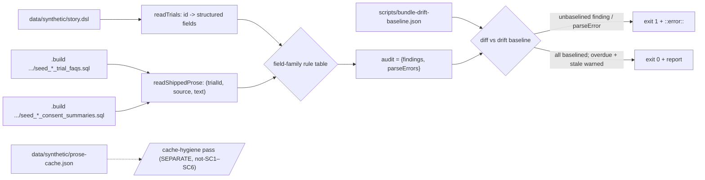

# Design A — Spec 300: Prose-vs-structured-field drift detector

Detects generated patient-facing prose that contradicts the `story.dsl`
structured field it derives from, over the vendored `data/synthetic/` bundle,
and routes each finding upstream to `fit-terrain`. Detect-and-route only — the
gate never edits the vendored bundle. **Operand = the trial-keyed shipped prose:**
the rendered `trial_faqs.faq` AND `consent_summaries.summary` rows — the two
`per_trial` prose tables — one shipped row per trial per source, not a
`prose-cache.json` key.

## Restatement

- **Problem.** `story.dsl` (structured truth) and the generated patient-facing
  prose are reconciled by nothing. A contradiction baked into the bundle —
  DIABPREV-201's shipped FAQ and its consent summary each tell the patient about
  300 people will join, while its `status` is `active_not_recruiting` at 298/300
  — reaches the patient verbatim.
- **Scope.** One in-tree DETECT+ROUTE gate over `data/synthetic/`, rule stated
  once and parameterized by structured field: a shipped prose assertion must not
  contradict the field it derives from; on contradiction, flag and route
  upstream, never edit the bundle. Charter is the **trial-keyed shipped prose** —
  both `per_trial` tables (`trial_faqs`, `consent_summaries`).
- **Success (SC1–SC6).** Reports DIABPREV-201's shipped drift — now on both its
  FAQ and its consent row (SC1); clean on CARDIO-301 with its actual "currently
  enrolling" string asserted (SC2); never mutates the bundle (SC3); emits a
  durable routed record naming trial + which shipped row + conflicting field
  (SC4); the criteria family and the consent source each land as data, not a
  second detector (SC5); runs in the `check-seed` CI job so future drift fails
  before merge (SC6).

## The operand ruling (consumed, not re-litigated)

PM ruled the operand questions closed (design-inputs.md#issue-127-299-detector-fold,
2026-08-02; **operand widened 2026-08-05** to add `consent_summaries.summary`);
this design consumes them:

- **Q1 — scope = the two `per_trial` prose tables.** Of the six rendered prose
  tables, exactly `trial_faqs` and `consent_summaries` are keyed `per_trial`
  (`story.dsl:1241-1242`) — both trial-keyed, both shipped verbatim to the
  patient (`show-trial.js:59-62`). The other four are deferred as non-trial-keyed
  under one join reason: `condition_explainers` (condition), `site_descriptions`
  (`per_site`), `patient_stories` and `therapy_descriptions` (topic/condition
  lists). Checking any of them needs a `→trial` join the spec does not define and
  no SC exercises. **The operand is the prose tables keyed `per_trial`** — a
  declared, spec-gated future extension covers the rest once its join exists.
- **Q2 — operand identity = the rendered row, per source.** For each source the
  operand is the **rendered value** — the exact bytes of the `trial_faqs.faq` /
  `consent_summaries.summary` row, seeded by the verbatim hyphen `story.dsl` trial
  id — never a `prose-cache.json` key chosen by spelling or `#hash`. The gate
  CANNOT pick the shipped variant from the cache: multiple `#hash` variants sit
  under one hyphen spelling (FAQ verified: `oncora-phase3` ships `#cfe85995`, not
  `#f59f778e`; consent verified: three diabetes-prevention keys —
  `-prevention#6dc13c9f`, `-prevention#940cc013`, `_prevention#940cc013` — collide
  on `#hash`/spelling with different text). So each shipped operand is read from
  the **render output**, not reconstructed from the cache.

## Architecture

A single read-only Node gate, `scripts/bundle-consistency-gate.js`, modeled on
the existing `scripts/audit-gate.js` baseline gate. Its operands are the rendered
shipped-prose rows from the two `per_trial` sources (each tagged with its source)
and the `story.dsl` structured fields; it joins by trial id, applies one
field-family rule table, and diffs findings against a committed routed-findings
baseline, failing CI only on findings _not_ baselined. The second source is one
more reader feeding the same engine — no second detector, no new join. A separate,
clearly-labeled hygiene pass over unreferenced cache keys is distinct from the
SC1–SC6 shipped-prose operand.

## Components

| Component                           | Responsibility                                                                                                                                                                                                                                                                                                                                                                                                                                                                           | Interface                                                    |
| ----------------------------------- | ---------------------------------------------------------------------------------------------------------------------------------------------------------------------------------------------------------------------------------------------------------------------------------------------------------------------------------------------------------------------------------------------------------------------------------------------------------------------------------------- | ------------------------------------------------------------ |
| `readTrials(storySrc)`              | Scoped brace-depth reader over `story.dsl`: per `trial <id> { … }`, extract declared structured fields (`status`, nested `criteria`). Not a general DSL parser — reads exactly the fields the rules need.                                                                                                                                                                                                                                                                                | `→ { trials: {id: {status, criteria, …}}, parseErrors: [] }` |
| `readShippedProse(seedSrc, source)` | One scoped reader, called per source over the rendered `seed_*_trial_faqs.sql` and `seed_*_consent_summaries.sql` that `build-seed.sh` produces (`data/synthetic/.build/.../migrations/`, gitignored render output — NOT the vendored source). Extract each `(trial_id, text)` INSERT row tagged with its `source` — the exact bytes a patient reads. One shipped row per trial per source; no cache key, `#hash`, or spelling ever enters the operand. Merged into one row stream.      | `→ { rows: [{trialId, source, text}], parseErrors: [] }`     |
| Field-family rule table             | Data, not code paths. Each family declares the structured `field` it reads and `contradicts(text, value) → null \| {reason, excerpt}` — source-agnostic, run over every shipped row regardless of which table it came from. Adding a family adds a row, never a pipeline.                                                                                                                                                                                                                | `FAMILIES: Family[]`                                         |
| `runAudit(trials, proseRows)`       | Join each shipped row to its trial by `trial_id` (exact — the seed row already carries the resolved id; no spelling normalization), carrying its `source`. Run every family over every row; collect findings. A row whose `trial_id` matches no `story.dsl` trial is a `parseError` (fail-closed), never a silent drop.                                                                                                                                                                  | `→ {findings, parseErrors}`                                  |
| `diffLedger(audit, baseline)`       | Set-diff findings against the drift baseline by key. Partition into `unbaselined` (fail), `overdue` (baselined, `review_by` past — warn), `stale` (baselined finding no longer reproducing — warn, flag for removal). The accepted set neither masks new drift nor accretes dead entries.                                                                                                                                                                                                | `→ {unbaselined, overdue, stale}`                            |
| Routed-findings drift baseline      | Committed `scripts/bundle-drift-baseline.json` — the durable SC4 record, outside the vendored `data/synthetic/` tree (human-owned, never vendored). Each entry carries the full baseline-diff key (§Interfaces) plus the upstream route (`fit-terrain` ref + optional `review_by`). Ships baselined: DIABPREV-201's status finding on BOTH sources (FAQ + consent). A new finding absent from the baseline fails CI. The committed JSON is canonical; slugs named here are illustrative. | JSON, human-edited only                                      |
| Cache-hygiene pass (SEPARATE)       | Optional, clearly-labeled, **explicitly not-SC1–SC6**: scans `prose-cache.json` `clinical_trial_faq_` keys that render ZERO rows (spelling aliases, non-shipped `#hash` variants, orphan slugs `diabex_p2`/`lungshield_p1`/`neuregen_p2`/`oncora_p3`). A newly-unreferenced key fails CI as **cache hygiene**, reported under its own label with its own `scripts/bundle-cache-hygiene.json` accepted-set. Never mixed into the shipped-prose drift ledger.                              | `→ {newlyUnreferenced}`                                      |
| CI step                             | New step in `check-seed.yml`, ordered **after** `build-seed.sh` renders (so both `seed_*_trial_faqs.sql` and `seed_*_consent_summaries.sql` exist), running the gate; plus `bundle-consistency-gate.test.js` under `bun test scripts`.                                                                                                                                                                                                                                                   | —                                                            |

## Interfaces

- **Finding.** `{source, trial, field, structuredValue, excerpt, reason}`. Two
  keys, defined here once (every other mention refers back):
  - **Row identity** `source:trial:field` — WHICH shipped row drifted on WHICH
    family. `source` is load-bearing: a trial's FAQ and consent can each
    contradict the same `status`, and each is a distinct prose artifact routed
    upstream separately, so they are two findings, never collapsed to one. NOT a
    cache key or `#hash`.
  - **Baseline-diff key** `source:trial:field:structuredValue` — row identity
    plus the structured value. `structuredValue` is in the diff key so an
    upstream change (`active_not_recruiting → recruiting`) yields a new key that
    reads as unbaselined, never a silent match against the old entry.
- **Family.** `{field, read(trial), contradicts(text, value)}` — source-agnostic.
  The `status` family: `read` returns the trial `status`, `contradicts` maps it to
  recruiting-open via a fail-safe classifier then flags text asserting the
  opposite state (this also catches the self-contradicting FAQ, since one half
  opposes the structured field). The `criteria-in-prose` family is the same shape
  over the same shipped rows, `field: "criteria"`, comparing restated eligibility
  values to the structured criteria rows (both DIABPREV-201's FAQ and its consent
  "WHO CAN JOIN" block restate criteria). Its comparator is materially harder
  (text-vs-rows) but stays inside the one `(text, value) → null | finding`
  contract — added depth is plan/impl work in one engine, not a second pipeline
  (SC5).
- **Audit output.** `{findings: Finding[], parseErrors: ParseError[]}` — always a
  two-field object, never a bare array. A malformed operand, or a shipped row
  whose `trial_id` joins to no trial, surfaces as a `parseError` (fail-closed,
  exit 1 unless baselined), never silence.

## Key Decisions

| Decision                                                                                                                                                             | Why                                                                                                                                                                                                                                                                                                                                                                                                                                                                                    | Rejected alternative                                                                                                                                                                                                                                   |
| -------------------------------------------------------------------------------------------------------------------------------------------------------------------- | -------------------------------------------------------------------------------------------------------------------------------------------------------------------------------------------------------------------------------------------------------------------------------------------------------------------------------------------------------------------------------------------------------------------------------------------------------------------------------------- | ------------------------------------------------------------------------------------------------------------------------------------------------------------------------------------------------------------------------------------------------------ |
| **Shipped-prose operand = the rendered rows of the two `per_trial` tables** (`trial_faqs.faq` + `consent_summaries.summary`), read from their `seed_*` build outputs | Per the Q2 ruling the operand is the exact bytes a patient reads; per the 2026-08-05 widening, consent is the second trial-keyed shipped surface carrying the same harms on the charter trial. The render selects the shipped variant by a prompt-hash lookup the gate can't reconstruct, and multiple `#hash` variants share a hyphen spelling. Reading the render output is the ONLY way to name exactly what ships; the rendered columns ARE the prose — nothing is projected away. | Read `prose-cache.json` and select by slug/`#hash`: forbidden by Q2 — picks a variant by spelling heuristic and can't tell which of several `#hash` rows renders. This retires the prior cache-key model (alias `_`≡`-` resolution + orphan-baseline). |
| **A second operand SOURCE, not a second detector — one reader per `per_trial` table, merged into one `{trialId, source, text}` stream**                              | The consent widening is one more reader feeding the SAME join + rule table + diff. Because consent is `per_trial`, no condition→trial join is added (the deferral that keeps explainers out does not apply). SC5's "same rule, data not code" holds at the source level.                                                                                                                                                                                                               | Parallel consent pipeline / second detector: duplicates the join+emit+diff the #299/#127 fold exists to avoid.                                                                                                                                         |
| **Both keys gain a `source` segment** (row identity `source:trial:field`, diff key adds `structuredValue`; defined in §Interfaces)                                   | The ONE contained interface change the widening forces: without `source`, a trial's FAQ-drift and consent-drift on the same `field` collapse to one key and one upstream route is lost. Why they must stay two findings (distinct prose artifacts, routed separately) lives in §Interfaces.                                                                                                                                                                                            | Key on `trial:field` only (the prior design): the two shipped rows collide, one upstream route is lost — a silent under-count on the flagship trial.                                                                                                   |
| Structured operand stays source-side: `story.dsl` via scoped brace-depth reader                                                                                      | The invariant is "shipped prose must not contradict the field it _derives from_" — the field is the vendored source; reads exactly `status`/`criteria`, bounded and unit-testable.                                                                                                                                                                                                                                                                                                     | Reuse `fit-terrain`'s parser: a devDep bin that emits SQL, not a field API.                                                                                                                                                                            |
| Rule table parameterized by field family                                                                                                                             | One engine; a new field family (criteria, later phase/enrollment) is a data row, satisfying SC5 structurally.                                                                                                                                                                                                                                                                                                                                                                          | A detector per field: duplicates the join + emit + diff — the ~80% restatement the #299/#127 fold exists to avoid.                                                                                                                                     |
| Drift baseline; CI fails only on _unbaselined_ findings                                                                                                              | Reconciles SC1 (gate reports the real DIABPREV-201 drift) with SC6 (CI stays green): the existing finding ships baselined+routed, only _new_ drift fails. The baseline _is_ the SC4 durable record. Sibling of `audit-gate.js` + `security/audit-baseline.json`.                                                                                                                                                                                                                       | Hard block with no baseline: red-walls forever, since the real finding is unfixable in-tree. Report-only: fails SC6.                                                                                                                                   |
| **Orphan/unreferenced-key check is a SEPARATE cache-hygiene ledger, not part of SC1–SC6**                                                                            | Per Q2, keys that render zero rows never ship, so they are not the shipped-prose operand. "A new orphan fails CI" keeps its teeth but as a distinct, clearly-labeled hygiene concern with its own accepted-set — it can never mask or be masked by shipped-prose drift.                                                                                                                                                                                                                | Fold orphans into the drift baseline (the prior design): conflates cache hygiene with shipped-prose drift, exactly what the ruling separates.                                                                                                          |
| Gate never writes either baseline; entries carry `review_by`; gate flags _stale_ entries                                                                             | A self-appending baseline self-heals and masks new drift (the spec-110 concern). Baselining is a conscious human PR edit that routes the finding upstream first; a no-longer-reproducing entry is flagged _stale_ for removal.                                                                                                                                                                                                                                                         | Auto-append on finding / opaque permanent allowlist: silently absorbs new, resolved, and slipped findings alike.                                                                                                                                       |
| Fail-SAFE recruiting classifier: unknown `status` → "not confirmed open"                                                                                             | Never treats an unrecognized status as recruiting; a future vendored value cannot make the gate assert a trial is open. A small self-contained pure predicate — see Cross-cutting.                                                                                                                                                                                                                                                                                                     | Closed whitelist of open statuses: an unlisted value falls through to a wrong verdict — the fail-open trap spec 280 also forbids.                                                                                                                      |
| Gate lives in `check-seed.yml`, ordered after the render step                                                                                                        | SC6 names the seed-check job; the shipped-prose operand is a render artifact, so the gate runs after `build-seed.sh` produces both `seed_*` tables. SC3's `sha256sum -c SOURCE.sha256` (over the vendored source, not the `.build` output) still passes.                                                                                                                                                                                                                               | Independent pre-render step: the shipped operand doesn't exist yet. New standalone workflow: another required check the seed job already hosts.                                                                                                        |

## Data flow and failure modes

1. `check-seed` runs `build-seed.sh` (render), then `bun scripts/bundle-consistency-gate.js` as its own step.
2. `readTrials(story.dsl)` + `readShippedProse` over both `seed_*_trial_faqs.sql` and `seed_*_consent_summaries.sql` (merged) → `runAudit` → `diffLedger`.
3. Exit 1 (`::error::`) on any unbaselined finding or unjoinable-row `parseError`.
   The separate hygiene pass exits 1 under its own label on a newly-unreferenced
   key. Overdue-`review_by` and stale baseline entries emit an every-run
   `::warning::` but never block. Always print the full report.
4. SC3 holds by construction: the gate only reads (vendored source + `.build`
   render output); `build-seed.sh`'s `sha256sum -c SOURCE.sha256` over the
   vendored source still passes after a run.

## Cross-cutting

- **SC2 is a non-vacuous pass (low note, confirmed).** The CARDIO-301 pass-case
  test asserts the trial's actual shipped FAQ string (`status "recruiting"`, FAQ
  says "currently enrolling") is read AND yields no finding — not merely "no
  finding emitted." A pass that never read a real "currently enrolling" string
  would be a false green; the plan's test pins the asserted string.
- **SC5 holds on both axes — data, not detectors (confirmed).** A new field
  family (criteria) adds one `FAMILIES` row + a `contradicts` comparator; a new
  operand source (consent) adds one reader call + a `source` tag. Both stay
  inside the one `(text, value) → finding` contract over one join/emit/diff path —
  no parallel pipeline on either axis. Reviewed here per SC5.
- **Recruiting-vs-not is a natural shared primitive with spec 280** (screener
  fail-open watch): both classify `story.dsl` `status` into recruiting-open and
  must fail-safe on unknown values. This gate defines its own small pure
  predicate and does **not** depend on spec 280 (unmerged; different contract).
  If both land, the predicate is a de-dup candidate — a forward note, not a
  dependency this design imposes.
- **Explainer flag DISCHARGED.** The prior design flagged explainer scope and the
  hyphen-vs-alias spelling as open questions for PM; both are now RULED (Q1/Q2).
  Condition-explainer is a consumed, spec-named future extension; the shipped
  spelling is the render's verbatim hyphen row. No open operand question remains.
- **Consumed design-inputs.** issue-127-299-detector-fold (incl. the 2026-08-02
  Q1/Q2 rulings AND the 2026-08-05 consent-summary operand widening): one
  detect+route detector parameterized by field over the trial-keyed shipped-prose
  sources, `status` charter + criteria second family, correction terminates
  upstream, does _not_ close #127's staff-flag residual. spec-270 §1: audit output is a two-field
  `{findings, parseErrors}` object — a malformed or unjoinable operand is a
  diagnostic, never silence. (spec-270 §2/§3 ESM-on-`github-script` seam is N/A:
  this gate is a token-free `node` script with no privileged surface.)

## Clean break and scope

Additive by spec (Compatibility: "clean break not applicable"). The gate is a new
read over existing data; no shipped path is removed or shimmed. **Removes:**
nothing — there is no prior reconciliation to replace. It does not touch the
render path, does not edit the bundle, and does not close #127's headline
residual (a structured field stale versus the real-world protocol has no in-tree
operand — that stays a staff-flag on #127).

— Staff Engineer 🛠️
