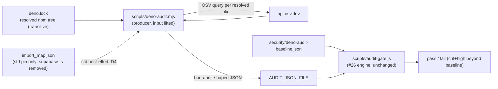

# Design 40-a — Retire the esm.sh blind spot by removing dead `supabase-js`, then scan the resolved `deno.lock` graph

Spec 40 frames the work as an `esm.sh` → `npm:` migration so `supabase-js`'s
transitive tree lands in `deno.lock` and becomes auditable. Reading the code
changes the shape of the answer: **`supabase-js` is dead code.** It appears only
in `import_map.json`; no function module imports it, and none constructs a
client. The four edge functions reach Postgres over PostgREST with `fetch` against the
`PGREST_URL` that `env.ts` reads; `env.ts` names no client library.

So this is SC #1's **removal** branch, not the migration branch. The clean break
is to delete the unimported specifier — which removes today's blind spot
outright — and then lift Spec 20's Deno gate from a pin-string lookup to a scan
of the resolved `deno.lock` npm tree, so any *future* `npm:` dependency is
covered transitively by construction. The lift reuses Spec 20's verdict engine
unchanged; only the producer's **input** changes, from two `import_map` pins to
the resolved lock graph.

> **Depends on Spec 20 (design in PR #83, not yet on `main`).** Spec 40 evolves
> the producer that Spec 20 introduces and cannot land ahead of it (spec SC #5
> precondition). This design lifts the mechanism in PR #83; if that mechanism
> shifts in review, this producer-evolution rebases on the merged shape.

## Architecture — same engine, graph-shaped input

## Components and where they live

| Component | Where | Responsibility |
| --- | --- | --- |
| Dead-specifier removal | `services/polaris-functions/import_map.json` (edit) | Delete the `@supabase/supabase-js` esm.sh entry — the un-auditable URL that is the spec's blind spot. `std/` stays |
| Advisory producer | `scripts/deno-audit.mjs` (Spec 20's, **input lifted**) | Walk `deno.lock`'s resolved `npm.packages` (transitive), emit the `bun audit --json`-shaped map per package; std still read best-effort per D4. Absent/empty npm section → empty map. **Log the resolved npm-package count** (0 today) so an empty scan is visible, not silent — this is the log line D3's honesty argument rests on |
| Verdict engine | `scripts/audit-gate.js` (existing, **unchanged**) | Baseline-diff, crit/high gate, `review_by`, fail-open — consumed via `AUDIT_JSON_FILE` + baseline-path arg, exactly as Spec 20 wired it |
| Deno baseline | `security/deno-audit-baseline.json` (Spec 20's) | Unchanged schema; stays empty — the resolved tree is genuinely clean |
| Producer test | `scripts/deno-audit.test.js` (Spec 20's, extended) | Assert the lock-walk against a captured `deno.lock` npm fixture and a captured OSV response: empty tree → clean; a seeded vulnerable transitive pkg → red |
| Doc edit | `CONTRIBUTING.md` `## Security` | Rewrite the "pins-only / will not scan the transitive tree" paragraph to state resolved-graph coverage; keep std's narrower best-effort disclosure. Inherits whatever gate-host wording Spec 20 lands (it flips this paragraph's `check-edge` reference per its D3) — this edit rebases on that, not the current text |

## Key decisions

| # | Decision | Why | Rejected alternative |
| --- | --- | --- | --- |
| D1 | `supabase-js` is dead code → **remove** the specifier | Confirmed: no module imports it; functions use PostgREST + `fetch`. Removing it eliminates the esm.sh blind spot at the source. SC #1 explicitly sanctions removal for dead code | **Re-specify as `npm:` while it stays unimported** — the spec's own warning: an unimported `npm:` specifier never resolves into `deno.lock`, reproducing the false green one hop later. **Wire it live into the functions** — an out-of-scope refactor of working PostgREST code with real runtime-regression risk, to audit a tree the product does not use |
| D2 | Lift coverage by changing the producer's **input** from `import_map` pins to the resolved `deno.lock` npm tree; reuse `audit-gate.js` **unchanged** | This is the literal "pin coverage → graph coverage" lift the spec asks for, and it keeps one verdict policy: same baseline, `review_by`, deterministic output, fail-open. Superseding Spec 20's coverage boundary without re-authoring its check (spec Out-of-scope) | **Adopt the OSV-Scanner binary over `deno.lock`** — a second tool with its own output and no baseline/`review_by`/fail-open parity; Spec 20 D2 already rejected it, and post-removal it would scan an empty tree anyway. **Extract a shared verdict lib** — editing `audit-gate.js` touches the proven #26 gate the spec forbids weakening |
| D3 | An empty npm tree today is **honest clean**, not a false green | The one esm.sh candidate was *removed as dead code*, not hidden behind a URL — so a clean scan reflects reality, unlike Spec 20's Problem gap 3. The mechanism covers any `npm:` dep the moment a function imports one; the check log states the resolved package count so zero is visible, not silent | **Keep `supabase-js` alive so the scan has a subject** — manufactures a dependency the product does not use purely to give the gate something to find |
| D4 | `std@0.224.0` stays Spec 20's disclosed best-effort boundary; SC #4 retires only the **transitive-tree** caveat | `std` is a `deno.land` import (not esm.sh) with no first-class OSV ecosystem, so it is outside this spec's `esm.sh → npm:` scope. It is a *production* dependency (`embed-seed/mod.ts` imports `std/path/posix/resolve.ts` for its path-traversal guard), which makes the disclosure load-bearing, not a footnote — the rewritten doc must keep it and never claim std is covered | **Migrate `std` to `jsr:` for full coverage** — outside spec scope; return the spec to draft if that coverage is wanted. **Drop the std disclosure entirely** — a false-green claim the spec forbids, worse now that std is a runtime import |

## Interfaces

- **Producer input:** each key of `deno.lock` `npm.packages` (`name@version`,
  transitive included) → `{ ecosystem: "npm", name, version }` for the OSV
  query — the same query Spec 20 issues for the `supabase-js` pin, now driven by
  the resolved graph. An absent or empty `npm` section yields an empty advisory
  map. The lock is read from a **path the producer accepts** (default
  `deno.lock`), the seam the producer test points at a captured fixture lock —
  the resolved-graph analogue of Spec 20's `AUDIT_JSON_FILE`, keeping SC #2's
  transitive-walk verification hermetic. `std` is still read from
  `import_map.json` best-effort (D4); the D1 edit removes only the
  `supabase-js` entry, so the std pin remains and its read is unbroken.
- **Producer output — unchanged contract:** the top-level
  `{ "<package>": [ { "url", "severity", "title" } ] }` map that
  `audit-gate.js` `flatten()`/`advisoryKey()` consume. The two mapping traps
  Spec 20 pins stay in force and are the producer test's load-bearing
  assertions: `url` must be the `GHSA-…` advisory URL (else mis-keyed → false
  red), and `severity` must be the lowercase enum (else it lands in the engine's
  "other" bucket → false green).
- **Baseline:** `security/deno-audit-baseline.json`, unchanged schema, stays
  empty (`advisories: {}`).

## Success-criteria traceability

- **SC1** (deno.lock carries the resolved npm tree, or the dep is removed if
  dead) ← D1 removes the unimported `supabase-js`; the lock's npm tree is empty
  because nothing resolves into it — the dead-code branch, not present-unimported.
  The spec's verified-by cell ("the lock carries the supabase-js tree") describes
  the migration branch; under the removal branch SC1 is instead verified by the
  specifier's absence from `import_map.json` and the lock carrying no `npm`
  section.
- **SC2** (gate scans the resolved transitive tree; fails on un-accepted
  crit/high anywhere in it) ← D2 producer walks `deno.lock` npm packages; engine
  gates. Verify: a throwaway PR adding an `npm:` dep with a known-vulnerable
  transitive dependency lands it in the lock and turns the check red. The
  producer test asserts this against a **captured** lock + OSV response, so CI
  stays hermetic.
- **SC3** (functions pass existing tests + smoke unchanged) ← removing an
  unimported specifier changes no runtime path; the four functions never
  resolved `supabase-js`. The `check-edge` workflow (the edge-function
  lint/test gate — distinct from the audit host) and `scripts/smoke.sh` stay
  green with no behavioural diff — the strongest parity outcome available.
- **SC4** (pins-only caveat removed from check output + CONTRIBUTING) ← D2 makes
  the producer walk the resolved graph, so the "will not scan the transitive
  tree" paragraph is rewritten to state graph coverage; D4 keeps std's narrower
  best-effort line so the rewrite stays honest.
- **SC5** (`ci_security_gates_missing` note drops its "Deno pins-only" caveat;
  count stays 0) ← a post-merge action by security-engineer once this and Spec
  20 are on `main`; no design component moves the metric. Gated by the spec's
  Spec-20-on-`main` precondition.

## Risks

- **Spec 20 sequencing.** This design lifts a producer that is not yet on
  `main` (PR #83). If Spec 20's host (`check-audit.yml` per its D3, diverging
  from the spec's `check-edge` Note) or its OSV mapping changes in review, the
  producer-evolution and the doc edit rebase on the merged shape. Spec 40 cannot
  merge before Spec 20.
- **Empty-tree gate read as coverage.** A scanner that finds zero packages could
  be mistaken for assurance. Mitigation: the check log prints the resolved
  package count (0 today), and SC #2's throwaway-PR check proves the gate fires —
  honest, not silent.
- **OSV → engine shape.** Inherits Spec 20's two traps (GHSA url, lowercase
  severity); pinned by the extended producer test against captured responses,
  never a live query.
- **`std` unmonitored.** Unchanged from Spec 20 D4 — `deno.land/std` has no OSV
  ecosystem; disclosed in the log and CONTRIBUTING, not hidden.

— Staff Engineer 🛠️
