# Design 50 — `next` 14 → 15 on the patient surface

**Security deadline: 2026-07-24.** This design and Spec 30 are the coupled
countermeasure that takes the repo to **0 critical/high advisories**; the audit
goes green on merge to `main`, no release cut needed. This half clears the
patient-reachable highs:

| GHSA                        | Sev      | Note                                                                           |
| --------------------------- | -------- | ------------------------------------------------------------------------------ |
| `GHSA-c4j6-fc7j-m34r` (8.6) | **high** | SSRF via WebSocket upgrades — gated by self-hosting (present)                  |
| `GHSA-8h8q-6873-q5fj`       | **high** | DoS with Server Components — App Router renders SC                             |
| `GHSA-h25m-26qc-wcjf`       | **high** | DoS via RSC request deserialization                                            |
| `GHSA-q4gf-8mx6-v5v3`       | **high** | DoS with Server Components                                                     |
| `GHSA-36qx-fr4f-26g5`       | **high** | Middleware/proxy bypass (Pages i18n) — closed, not relied on                   |
| `GHSA-26hh-7cqf-hhc6`       | **high** | Segment-prefetch proxy bypass — **surfaces on bump**, clears only at `15.5.18` |

Plus the `next`-carried moderates/lows in the `<15.5.16` window (CSP-nonce XSS
`GHSA-gx5p-jg67-6x7h`, cache-poisoning `GHSA-3g8h-86w9-wvmq` /
`GHSA-vfv6-92ff-j949` / `GHSA-wfc6-r584-vfw7`, image-optimizer DoS, request
smuggling `GHSA-ggv3-7p47-pfv8`). Spec 30 clears the critical and the `vite`
high; both must land for the goal.

## Problem (restated)

`products/polaris/site` pins `next@14.2.35`, carrying 5 highs reachable from the
self-hosted patient site. They are patched only in `next ≥ 15.5.16`, a breaking
major. The #45 spike proved `15.5.16` is **not enough**: it surfaces a sixth
high (`GHSA-26hh`) that clears only at `15.5.18`. **Migration floor is
`next ≥ 15.5.18`.** A green auto-merge cannot ship a major to a patient-facing
deployment unverified — the blast radius below needs architectural review.

## Architecture (WHICH / WHERE)

The pin change is trivial; the design is the **async request-API boundary** that
Next 15 makes breaking. `params`, `searchParams`, and `next/headers` `cookies()`
become Promises. The migration awaits them at every call site. `NextRequest`
(`.cookies`, `.nextUrl.searchParams`) stays synchronous — so the route-handler
context helper is untouched.

```mermaid
graph TD
  bump[next 14.2.35 → 15.5.18<br/>package.json + bun.lock] --> cfg[next.config.mjs<br/>outputFileTracingRoot → top-level]
  bump --> async[async request-API boundary]
  async --> pages[4 param pages + 4 searchParams pages<br/>await params / await searchParams]
  async --> handlers[3 dynamic route handlers<br/>await params]
  async --> admin[buildAdminCtx: await cookies&#40;&#41;<br/>→ becomes async → admin page awaits it]
  req[buildCtxFromRequest<br/>NextRequest.cookies / nextUrl] -. unchanged: NextRequest stays sync .-> async
  cfg --> build[standalone build emits server.js]
```

| Component              | Where                                                                                                                                        | Change                                                                                                                                                                                        |
| ---------------------- | -------------------------------------------------------------------------------------------------------------------------------------------- | --------------------------------------------------------------------------------------------------------------------------------------------------------------------------------------------- |
| Framework pin          | `products/polaris/site/package.json` `dependencies.next`                                                                                     | `14.2.35 → 15.5.18`                                                                                                                                                                           |
| Build config           | `next.config.mjs`                                                                                                                            | `experimental.outputFileTracingRoot` → top-level `outputFileTracingRoot`; `output: standalone`, `transpilePackages`, webpack templates-stub alias survive as-is                               |
| Param pages (4)        | `conditions/[id]`, `trials/[id]`, `trials/[id]/eligibility`, `admin/trials/[id]` `page.tsx`                                                  | `params: Promise<{id}>`, `await` before use                                                                                                                                                   |
| searchParams pages (4) | `search`, `sites`, `stories`, `trials/[id]/eligibility` `page.tsx` (`eligibility` shared with the param-pages row — 11 distinct files total) | `searchParams: Promise<…>`, `await` before `collapse()` / reads                                                                                                                               |
| Param handlers (3)     | `api/conditions/[id]`, `api/trials/[id]`, `trials/[id]/eligibility/submit` `route.ts`                                                        | `params: Promise<{id}>`, `await` before `.id`                                                                                                                                                 |
| Admin cookie read      | `src/lib/build-ctx.ts` `buildAdminCtx`                                                                                                       | `cookies()` → `await cookies()`; helper becomes `async`; admin page awaits it                                                                                                                 |
| Request helper         | `src/lib/build-ctx.ts` `buildCtxFromRequest`                                                                                                 | **unchanged** — `NextRequest.cookies` / `nextUrl.searchParams` stay sync in 15                                                                                                                |
| `collapse()` helper    | `src/lib/build-ctx.ts`                                                                                                                       | **unchanged** — still takes a resolved `SearchParams` object; only its callers await first                                                                                                    |
| Test call sites (5)    | `src/__tests__/*.test.tsx`                                                                                                                   | call sites pass page props as plain objects (`await SearchPage({ searchParams: {...} })`); wrap them in `Promise.resolve({...})` to match the now-`Promise`-typed props. Assertions unchanged |
| Audit baseline         | `security/audit-baseline.json`                                                                                                               | remove the 5 `next` GHSA ids (criterion 8)                                                                                                                                                    |

## Key Decisions

| Decision                 | Choice                                                                                   | Rejected alternative                                                                                                                                                                                                                                               |
| ------------------------ | ---------------------------------------------------------------------------------------- | ------------------------------------------------------------------------------------------------------------------------------------------------------------------------------------------------------------------------------------------------------------------ |
| Target version           | **`next@15.5.18`** (or later 15.5.x)                                                     | `15.5.16` — spike-proven to leave `GHSA-26hh` open. Rejected on evidence.                                                                                                                                                                                          |
| React version            | **Hold `react`/`react-dom` at `18.3.1`**                                                 | Bump to React 19. Rejected: Next 15's peer range accepts `^18.2`; the #45 spike resolved `15.5.18` against the committed 18.3.1 lockfile. React 19 is a separable blast radius the spec excludes unless a hard peer requirement appears — build/smoke is the gate. |
| Async-API migration path | **Hand-apply the `await` boundary** across the enumerated call sites (small, closed set) | Run the `next-async-request-api` codemod repo-wide. Rejected: the set is 11 files; a targeted edit is auditable and avoids codemod churn in unrelated code.                                                                                                        |
| Caching posture          | **Preserve explicit `force-dynamic`** on all 8 handlers + all dynamic pages              | Adopt Next 15's uncached-by-default and drop the directives. Rejected: criterion 7 requires no silent caching-mode switch; explicit directives keep intent legible and mask the default flip (a no-op here).                                                       |
| Config key move          | **Promote `outputFileTracingRoot` to top-level**                                         | Leave under `experimental`. Rejected: 15 graduates it to stable; the experimental key would warn or be dropped. The standalone `server.js` path the Dockerfile depends on rides on it.                                                                             |

## Data flow / blast radius

- **Async boundary is the whole migration.** Every enumerated page/handler is
  already `async` (all `await` a handler call today), so adding `await
params`/`await searchParams` is additive, not a control-flow rewrite. `params`
  reads feed `buildCtx({}, { id })`; `searchParams` reads feed `collapse()` —
  both consume resolved objects, so only the resolution point moves.
- **Admin auth ripple.** `buildAdminCtx` reads the `sb-staff-jwt` cookie via
  `next/headers` `cookies()`, which becomes async. The helper turns `async`; its
  sole caller (`admin/trials/[id]/page.tsx`) awaits it. Anon read pages using
  `buildCtx` are unaffected — `buildCtx` reads no cookie.
- **Route-handler auth is unaffected.** `buildCtxFromRequest` reads from
  `NextRequest`, which is not part of the async-ification. The handlers that read
  auth through it are byte-identical (`health` returns a static payload; `submit`
  builds an anon ctx inline — neither touches the async boundary either).
- **RSC correctness bar.** The three reachable-today highs are Server-Component /
  RSC DoS. The bar is that the RSC render path and 8 handlers return equivalent
  responses; `smoke.sh` proves boot + 200s but not per-route equivalence, so
  equivalence is a design/review obligation (criterion 7) discharged by the 5
  Testing Library suites (after their call sites are migrated to `Promise`-typed
  props — see the change table) plus a caching-posture walk at review.
- **Caching ledger.** All 8 route handlers and all 8 dynamic pages already
  declare `force-dynamic`; the sole directive-less page is the home `page.tsx`,
  which reads no per-request data. So Next 15's uncached-by-default flip changes
  no observable posture — criterion 7 is a per-page confirmation, not a change.

## Risks

| Risk                                                                                    | Likelihood | Mitigation                                                                                                                                                                                                                                                                                                                                                                                                     |
| --------------------------------------------------------------------------------------- | ---------- | -------------------------------------------------------------------------------------------------------------------------------------------------------------------------------------------------------------------------------------------------------------------------------------------------------------------------------------------------------------------------------------------------------------- |
| A missed `await` on `params`/`searchParams` yields a Promise where a string is expected | med        | Next 15's generated `PageProps`/route types make these `Promise<…>`, and `next build` (criterion 4) type-checks by default (no `typescript.ignoreBuildErrors` in `next.config.mjs`), so it fails on a missed `await`. Note: criterion 5 (`just lint`) is eslint+deno only and is **not** the type gate — the type gate is the build. Test call sites are covered by the same build type-check plus criterion 3 |
| React 18.3.1 hits a hard Next-15 App Router peer requirement at build time              | low        | Build (criterion 4) + smoke (criterion 6) are the gate; if a hard requirement surfaces, return spec to draft rather than bumping React silently                                                                                                                                                                                                                                                                |
| Caching-default flip silently changes a page not carrying `force-dynamic` (home page)   | low        | Home page reads no per-request data; review confirms its posture per criterion 7 — no page changes caching mode undeclared                                                                                                                                                                                                                                                                                     |
| Standalone `server.js` emits at a different path after the config move                  | low        | `outputFileTracingRoot` value is unchanged (monorepo root); criterion 4 asserts `server.js` at `products/polaris/site/`                                                                                                                                                                                                                                                                                        |

## Success criteria → mechanism

Criteria 1–2 met by the pin + lockfile re-resolve clearing all `next`-path
advisories; 3 by the 5 suites (call sites migrated to `Promise`-typed props)
under the awaited boundary; 4 by the standalone build after the config-key move —
this build is also the type gate that catches any un-awaited `Promise`; 5 by
`just lint` (eslint + deno, lint-only); 6 by `just smoke`; 7 by the
caching-posture review recorded at design approval; 8 by removing the 5 GHSA ids
from `security/audit-baseline.json` so the #26 gate baseline shrinks instead of
carrying stale entries.

— Staff Engineer 🛠️
