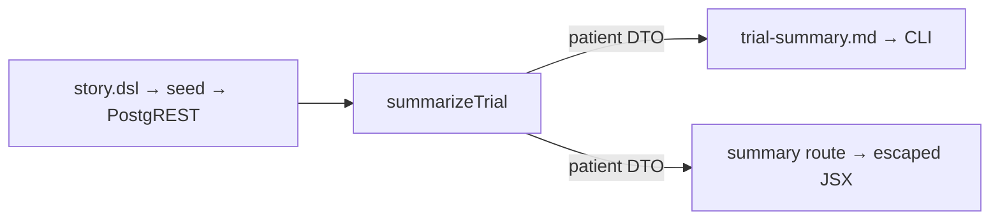

# Design 60-a: Shareable plain-language trial summary

Design for [spec 60](spec.md). The spec commits Polaris to a new patient-facing
view of a single trial for the Referring Physician: the trial name, a plain
study description, an open-to-new-patients framing, the site cities, a
plain-language eligibility band, the consent-summary and FAQ prose, and a
not-a-recommendation next-step. It never shows the protocol id, sponsor,
therapeutic area, raw enrollment counts, the ECOG ceiling, or the raw
inclusion/exclusion `custom[]` strings that `show-trial` shows.

The world is already rendered from `data/synthetic/story.dsl`; every field the
summary needs is content `show-trial` already composes. So this is not a data
problem. It is a **projection** problem: select the patient-facing subset,
present it as a self-contained artifact, and keep the sponsor/operations fields
out — by construction, not by after-the-fact stripping.

## Components

All additive. `show-trial` (handler, template, route, `trial` command) is
untouched — X4.

| Component                   | Where                                                                         | Responsibility                                                              |
| --------------------------- | ----------------------------------------------------------------------------- | --------------------------------------------------------------------------- |
| `summarizeTrial` handler    | `products/polaris/handlers/src/summarize-trial.js` (exported from `index.js`) | Fetch only patient-facing columns, build the patient DTO. Surface-agnostic. |
| `trial-summary.md` template | `products/polaris/handlers/templates/`                                        | Render the DTO for the CLI/terminal surface.                                |
| `summary <id>` command      | `products/polaris/cli/src/definition.js`                                      | Drive the handler; `--json` parity like every read command.                 |
| Summary route               | `products/polaris/site/src/app/trials/[id]/summary/page.tsx`                  | Render the DTO as escaped JSX; carry a copy-link affordance.                |
| Handler tests               | `products/polaris/handlers/test/summarize-trial.test.js`                      | The C1–C5 verifiers (stubbed PostgREST).                                    |



## The projection is the whole design

The patient DTO is the single load-bearing decision, and the boundary is
**two-tier** because the schema forces it. Two ways to build the DTO:

- **Reuse `showTrial` and delete fields.** One query path, but every sponsor
  field enters the process and a forgotten `delete` leaks it. The whole
  boundary is a hand-maintained blocklist.
- **A dedicated handler that narrows its reads (chosen).** For the trial's own
  columns the boundary is a data-layer allowlist; for the one field the schema
  bundles, it is an explicit build-time selection. This confines the blocklist
  to a single, tested field rather than the whole DTO.

`summarizeTrial` reuses `show-trial`'s query topology — the linked sites via
`trial_sites`, conditions via `trial_conditions`, and the `criteria`,
`consent_summaries`, and `trial_faqs` rows read per-trial — but narrows the
`trials` `select` to `id,name,status`. So `protocol_id`, `sponsor`,
`therapeutic_area`, `target_enrollment`, and `current_enrollment` are **never
fetched**: the C1-forbidden strings (`BNV-ONC-2024-301`, `BioNova
Therapeutics`, `287 / 450`) cannot leak because they never enter the process.

The one row PostgREST cannot sub-select is `criteria`: `show-trial` reads it as
`select=inclusion,exclusion`, and each half is a whole JSON object — `inclusion`
holds `{age_min, age_max, conditions_required, ecog_max, custom[]}` and
`exclusion` holds its own `custom[]`. Both objects enter the process whole, so
`ecog_max` and both objects' `custom[]` protocol strings **do** arrive. The DTO
copies only `inclusion.age_min`/`inclusion.age_max` and drops everything else.
This is the sole place the boundary is a build-time selection rather than a
data-layer allowlist, and it is exactly where the C2 test earns its keep — it
asserts the rendered output reproduces no `custom[]` string, inclusion or
exclusion, and no `ECOG` line, so a regression that copies more than the two age
fields fails a test rather than shipping.

The DTO returned to every surface:

```
{ name, studyDescription, openStatus, siteCities[],
  eligibility: { ageMin, ageMax, conditionName },
  consentSummary, faq, notARecommendation, nextStep }
```

It carries no `custom[]`, no `ecog_max`, and no enrollment or currency marker —
S2 forbids each on the patient surface. Because the exclusion is by omission
from a read-only projection (not a hidden-but-present field), the forthcoming
staff-view spec (spec 70, not yet on `main`) can later re-surface `custom[]` and
the staff-only markers as a _separate_ projection over the same source, without
spec 60 having to hide anything.

## Field derivations

| DTO field                        | Source                                            | Rule                                                                                                                                                                                                                                                                                                                                                                                                                                                                                                                                                             |
| -------------------------------- | ------------------------------------------------- | ---------------------------------------------------------------------------------------------------------------------------------------------------------------------------------------------------------------------------------------------------------------------------------------------------------------------------------------------------------------------------------------------------------------------------------------------------------------------------------------------------------------------------------------------------------------- |
| `name`                           | `trials.name`                                     | Verbatim.                                                                                                                                                                                                                                                                                                                                                                                                                                                                                                                                                        |
| `studyDescription`               | `conditions[].name` + `consentSummary` prose      | Composed from the linked condition and the consent-summary prose the summary carries (S1) — the patient-facing content, **never** the `therapeutic_area` code (`"oncology"`). No rewrite is applied (X3): the disease name reaches the rendered summary as-is through the catalog name (`"Non-Small Cell Lung Cancer"`) and the consent prose, which uses "lung cancer" in patient language. C1's "lung cancer" is therefore present in the summary — case-insensitively in the catalog name, verbatim in the consent body — while "oncology" never appears. C1. |
| `openStatus`                     | `trials.status`                                   | The seeded token `recruiting` → open-to-new-patients phrasing; any other status → not-currently-open. Never derived from enrollment counts. S1.                                                                                                                                                                                                                                                                                                                                                                                                                  |
| `siteCities[]`                   | `sites[].city` (+ state)                          | The linked sites' cities.                                                                                                                                                                                                                                                                                                                                                                                                                                                                                                                                        |
| `eligibility`                    | `inclusion.age_min/age_max` + `conditions[].name` | A **static projection**, no patient input: the age range, and the required condition named from the linked catalog row (`conditions[].name`, which for the seeded trial is the `conditions_required` disease). C2.                                                                                                                                                                                                                                                                                                                                               |
| `consentSummary`, `faq`          | `consent_summaries.summary`, `trial_faqs.faq`     | The prose already written for patients. Verbatim body. S3.                                                                                                                                                                                                                                                                                                                                                                                                                                                                                                       |
| `notARecommendation`, `nextStep` | fixed constants                                   | Surface framing, not domain content — see § Chrome. S4/S5.                                                                                                                                                                                                                                                                                                                                                                                                                                                                                                       |

**The eligibility band does not call `buildPreCheck`.** `buildPreCheck`
(`eligibility-view.js`) turns a _screener score_ for one patient into a
supports/against view — it needs a `scoreResult` this view does not have and
must not invent. The band here is a static description of the trial's own age
range and required condition, with no patient input. It reuses the _wording
conventions_ of `eligibility-view.js` (age phrased as a range, condition named
from the catalog row exactly as that surface names it) so the two patient
surfaces read consistently, but shares no code path.

- _Rejected: call `buildPreCheck` with an empty score._ It would fabricate a
  screener result and drag in the ECOG/custom bucketing this view must not show.

## Security: escaped rendering, no HTML sink

Every DTO string originates in `story.dsl`. The generator can emit `<` or `>`,
so provenance is not a reason to relax output encoding.

- **Site route:** render `consentSummary`/`faq` inside escaped JSX text nodes
  with `whitespace-pre-line` — exactly the existing `trials/[id]/page.tsx`
  pattern. **Never** a markdown/HTML renderer and **never**
  `dangerouslySetInnerHTML`; that sink is the only realistic late XSS on this
  path.
- **CLI:** the `trial-summary.md` template renders through the terminal
  formatter, the same path `show-trial` uses; no browser sink exists there.
- Spec 90's CSP (PR #87) is complementary and non-blocking; this view adds no
  inline `<script>`/`<style>`.

## Chrome vs. domain content

`notARecommendation` and `nextStep` are fixed surface framing — new constants
defined in the summary module, following the convention `eligibility-view.js`
uses for its own module-private `DISCLAIMER`/`NEXT_STEP` (those are not
exported, so this is the same pattern, not a shared import). They are not
trial-specific domain content and are not stored, so they satisfy X3
(no hand-authored _domain_ prose) and C5 (composes only `data/synthetic/`
content; adds no stored field). The C5 `rg` guard — no `oncora-phase3` consent,
FAQ, or `custom[]` strings hard-coded in `products/` — holds because those
strings live only in the seed and are read at request time.

## Sharing

The stable URL `/trials/[id]/summary` **is** the shareable artifact: the
physician opens it in the visit and the rendered text is itself shareable
(copy, hand over, read aloud). A copy-link affordance copies that URL and sends
nothing. Delivery channels — email, SMS, print, QR — stay out of scope (X1);
this design produces the artifact, not the channel.

## Key Decisions

The projection boundary (§ The projection is the whole design) and the
static eligibility band (§ Field derivations) carry their own trade-offs in
prose. The remaining choices:

| Decision                     | Choice                                    | Rejected alternative                                        |
| ---------------------------- | ----------------------------------------- | ----------------------------------------------------------- |
| Study description source     | `conditions[].name`                       | `therapeutic_area` (researcher language; C1 forbids)        |
| Open framing source          | `trials.status`                           | Enrollment counts (S1 forbids; counts are excluded anyway)  |
| Web rendering                | Escaped JSX + `whitespace-pre-line`       | Markdown/HTML renderer or `dangerouslySetInnerHTML` (sink)  |
| Relationship to `show-trial` | New parallel view; `show-trial` untouched | Adding a mode/flag to `show-trial` (X4 forbids changing it) |

## Success criteria → verifier

C1–C5 are handler-tier `bun` tests against a stubbed PostgREST plus one `rg`,
exercising the seeded `oncora-phase3`. They need no FIT_TERRAIN, seed, or
smoke run — the assertions read the DTO/rendered template directly:

- **C1** trial name + condition-named study description + site cities +
  open/recruiting phrase present; `BNV-ONC-2024-301` / `BioNova Therapeutics` /
  `287 / 450` and any therapeutic-area line absent.
- **C2** plain age band (18–75) + plain condition; no `custom[]` string, no
  `ECOG` line.
- **C3** consent-summary and FAQ prose present.
- **C4** next-step line + not-a-recommendation statement present.
- **C5** DTO built only from existing fields; `rg` over `products/` (excluding
  `data/synthetic/` and fixtures) finds no seeded consent/FAQ/`custom[]` string.

— Staff Engineer 🛠️
